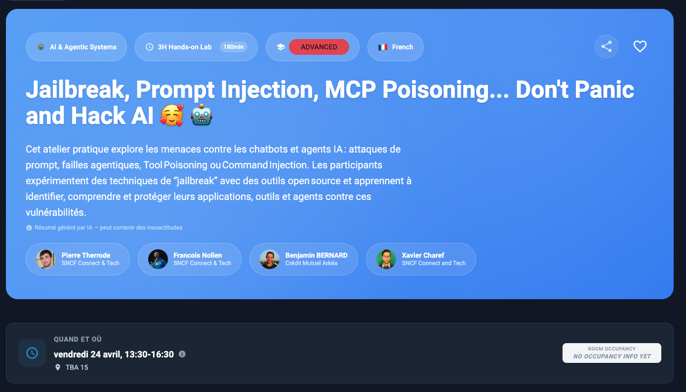

# [Devoxx 2026] Jailbreak, Prompt Injection, MCP Poisoning... Don't Panic and Hack AI 🥰 🤖

Ce projet github est issue du workshop fait par [Benjamin Bernard](https://www.linkedin.com/in/benvii/), [Xavier Charef](https://www.linkedin.com/in/xavier-charef-6b843497/), [François Nollen](https://www.linkedin.com/in/francois-nollen/) et [Pierre Therrode](https://www.linkedin.com/in/ptherrode/), pour le Devoxx 2026, avec comme sujet : [Jailbreak, Prompt Injection, MCP Poisoning... Don't Panic and Hack AI 🥰 🤖](https://m.devoxx.com/events/devoxxfr2026/talks/65312/jailbreak-prompt-injection-mcp-poisoning-dont-panic-and-hack-ai-)

## Info réseau

Point d'accès wifi :
* SSID: LLM_ATTACK
* Mot de passe: password

Lab AI Red Team partagé disponible ici : http://192.168.20.2:5000/login?auth=YOUR_AUTH_KEY

## Sommaire

  
🚧 💡 🚧 note sur La section “Introduction aux menaces de l’IA générative” 🚧 💡 🚧

    
La section “**Introduction aux menaces de l’IA générative**” vise avant tout à donner des repères pour comprendre les enjeux
et prendre du recul sur le sujet, avant de se lancer pleinnement dans la pratique ("**Comprendre les Principes du Prompt Injection et leurs Impacts**"). 

Lors du codelab, cette introduction sera présentée sous forme de diaporama (environ 10min). Cela permettra à chacun de 
préparer sereinement sa machine tout en se familiarisant progressivement avec la thématique abordée.

### Introduction aux menaces de l'IA générative (10 min)
 
- [1 - Il était une fois dans un monde numérique...](step_1.md)
- [2 - Pourquoi la sécurité des LLM est-elle cruciale ?](step_2.md)
- [3 - Des écarts sous contrôle relatif](step_3.md)
- [4 - Cadres de sécurité référents](step_4.md)

### Comprendre les principes du prompt injection (40 min)
 
- [5 - Introduction au playground et objectifs](step_5.md)
- [6 - Techniques d'attaque par prompt injection](step_6.md)
- [7 - Impacts réels et scénarios d'exploitation](step_7.md)

### Test de robustesse (30 min)

- [8 - Test de robustesse ?](step_8.md)
- [9 - PyRIT: Framework for Security Risk Identification and Red Teaming in Generative AI System](step_9.md)

### PAUSE (10 min)

### MCP: explication et menace (20 min)

 - [10 - Le Model Context Protocol : l'infrastructure manquante de l'ère AI-Native](step_10.md)
 - [11 - Les menaces de sécurité liées au MCP](step_11.md)

### MCP lab (60 min)

 - [12 - Prise en main de l'environnement MCP Labs](step_12.md)
 - [13 - Codelab : Shadowing d'Outils dans MCP](step_13.md)
 - [14 - Codelab : Attaque par "Rug Pull" (Tool Poisoning)](step_14.md)
 - [15 - Codelab : Indirect Prompt Injection via MCP](step_15.md)
 - [16 - Codelab : Command Injection (RCE) via un Serveur MCP](step_16.md)

### [BONUS] Évaluation et amélioration de la robustesse
 - [17 - Garak: A Framework for Security Probing Large Language Models](step_17.md)
 - [18 - Benchmarking avec Promptfoo](step_18.md)
 - [19 - AI Red Teaming](step_19.md)
 - [20 - Supply Chain Compromise via Agent Skill malicieux](step_20.md)

### [CONCLUSION] Pour aller plus loin (5 min)

- [Remerciements](thanks-you.md)
- [En savoir plus / ressources](resources.md)
