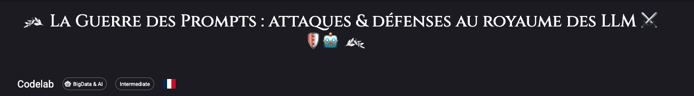
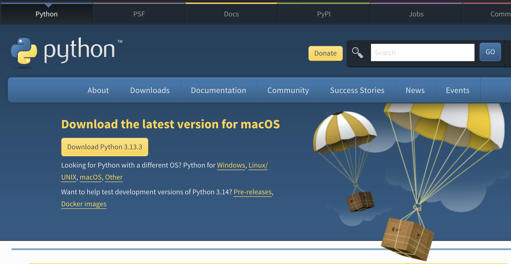
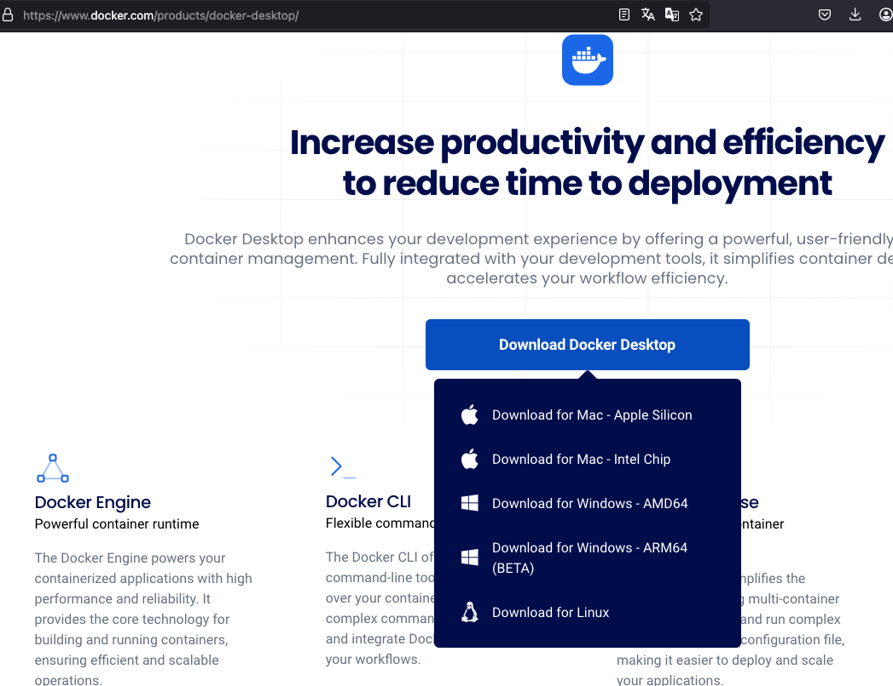

[](https://github.com/pi-2r/devoxxfr2026-workshop-jailbreak-prompt-injection-mcp-poisoning)

[](https://www.youtube.com/watch?v=xMglp0hAvbc)
> "You shall not pass !", Gandalf, LOTR - The Followship of the Ring


Ce tutorial est proposé en amont de la session **Jailbreak, Prompt Injection, MCP Poisoning... Don't Panic and Hack AI 🥰 🤖** à Devoxx France 2026.


## Sommaire

- [Codelab](#codelab)
  - [Récupérer l'atelier](#récupérer-latelier)
  - [Python](#python)
  - [L'outil Docker](#loutil-docker)


- [OpenAI](#openai)
  - [Récupérer une clé OpenAI](#récupérer-une-clé-openai)


- [Les images Docker](#les-images-docker)
  - [AI Red Teaming Playground Labs](#ai-red-teaming-playground-labs)


- [Les Labs MCP](#les-labs-mcp)


- [Installation des outils de tests de robustesse](#installation-des-outils-de-tests-de-robustesse)
  - [Installation d'uv](#installation-duv)
  - [Installation de Garak](#installation-de-garak)
  - [Installation de PyRIT](#installation-de-pyrit)
  - [Installation de Promptfoo](#installation-de-promptfoo)


    
### Récupérer l'atelier

Depuis votre terminal, récupérez le projet en clonant le dépôt :
  ```bash
  git clone git@github.com:pi-2r/devoxxfr2026-workshop-jailbreak-prompt-injection-mcp-poisoning.git
  ```
  
Vous pouvez également télécharger l'archive .zip du projet, puis la décompresser sur votre machine : https://github.com/pi-2r/devoxxfr2026-workshop-jailbreak-prompt-injection-mcp-poisoning/archive/refs/heads/main.zip

### Python

Installer Python 3.10 ou supérieur sur votre machine: https://www.python.org/downloads/



### L'outil Docker

Assurez-vous d’avoir installé  [Docker Desktop](https://www.docker.com/products/docker-desktop/) sur votre machine.



### Récupérer une clé OpenAI
Allez sur https://platform.openai.com/signup pour créer un compte et récupérer une clé API. Dés que vous etes connecté, 
allez dans la section [API Keys](https://platform.openai.com/api-keys) pour créer une nouvelle clé. Vous devrez avoir cette page :


Puis cliquez sur le bouton **Create new secret key** pour générer une nouvelle clé au moment voulu dans le lab.

> **Note** : OpenAI offre un crédit gratuit de 5$ pour les nouveaux utilisateurs, ce qui est suffisant pour réaliser 
les exercices de ce workshop. Cependant, une fois ce crédit épuisé, vous devrez fournir des informations de paiement 
pour continuer à utiliser les services d'OpenAI. Assurez-vous de surveiller votre utilisation pour
éviter des frais inattendus : https://termsoup.crisp.help/en-us/article/openai-free-trial-payment-token-limits-wds3wd/


<details>
  <summary>🚧 💡 🚧 Combien ça va me couter ? moins de 5 $ 🚧 💡 🚧</summary>

De notre côté, lors de la réalisation du workshop, avec une **utilisation régulière** de **gpt-3.5-turbo** et 
une **utilisation modérée** de **gpt-5-nano**, n’avons pas dépassé 5 $ de consommation.


</details>

Vous pouvez tester votre clef OpenAi par exemple avec une requête simple en curl :

```bash
curl https://api.openai.com/v1/responses \
-H "Content-Type: application/json" \
-H "Authorization: Bearer $OPENAI_API_KEY" \
-d '{
"model": "gpt-3.5-turbo",
"input": "Tell me a three sentence bedtime story about a unicorn."
}'
```


### Les images Docker

### AI Red Teaming Playground Labs

Depuis votre terminal, placez-vous dans le dossier où vous souhaitez installer le projet, par exemple **Documents**,
puis exécutez la commande suivante pour cloner le dépôt et entrer automatiquement dans le dossier créé :

```bash
git clone https://github.com/microsoft/AI-Red-Teaming-Playground-Labs.git && cd AI-Red-Teaming-Playground-Labs
```

Renommez le fichier **.env.example** en **.env**, puis commentez toutes les variables relatives à Microsoft OpenAI et
décommentez celles concernant OpenAI "classique". 

Ensuite, renseignez les valeurs attendues, comme la clé **OPENAI_API_KEY**, en lui attribuant votre clé d’API OpenAI à la place indiquée, selon l’exemple suivant :


Commentez les champs concernant Azure ou Microsoft, et assurez-vous que seules les variables nécessaires au 
service OpenAI "standard" restent actives dans le fichier **.env**.

Depuis le dossier **AI-Red-Teaming-Playground-Labs**, exécutez les commandes suivantes dans votre terminal :

```bash
source .env
docker compose -f docker-compose-openai.yaml up
```

Si tout est correctement configuré, vous devriez voir un affichage similaire à celui-ci :


Pour accéder à l’interface web, ouvrez votre navigateur et allez à l’adresse suivante :  http://localhost:5000/login?auth=YOUR_AUTH_KEY (la valeur de **YOUR_AUTH_KEY** est indiquée dans le fichier **.env**).

> 📌 Pour plus de détails sur l’utilisation du playground, consultez l’[Étape 5 — Introduction au playground et objectifs](step_5.md).


### Les Labs MCP

Le dossier `mcp/` à la racine du projet contient **4 labs pratiques** démontrant différents vecteurs d’attaque liés au Model Context Protocol :

| Lab | Répertoire | Description |
|-----|-----------|-------------|
| **Shadowing** | `mcp/mcp-shadowing/` | Usurpation d’outil entre deux serveurs MCP |
| **Rug Pull** | `mcp/mcp-rug-pull/` | Tool Poisoning via description empoisonnée |
| **Poisoning** | `mcp/mcp-poisoning/` | Indirect Prompt Injection via un CV piégé |
| **Command Injection** | `mcp/mcp-command-injection/` | RCE via injection de commandes OS |

Chaque lab est autonome et contient son propre `docker-compose.yml`, `Makefile` et `TUTORIAL.md`.

Pour lancer un lab, exportez votre clé API OpenAI puis déplacez-vous dans le répertoire souhaité :

```bash
export OPENAI_API_KEY="sk-..."
cd mcp/mcp-shadowing
docker-compose up --build
```

> 📌 Pour plus de détails sur la prise en main des labs MCP (GitHub Codespaces, lancement en local), consultez l’[Étape 13 — Prise en main de l’environnement MCP Labs](step_13.md).


### Les Labs de tests de robustesse

Le dossier `lab/` à la racine du projet contient les labs liés aux outils de test de robustesse :

| Lab | Répertoire | Description |
|-----|-----------|-------------|
| **Garak** | `lab/Garak_test/` | Probes et détections personnalisées pour Garak |
| **Promptfoo** | `lab/Promptfoo/` | Configuration de red teaming avec Promptfoo |
| **PyRIT** | `lab/PyRIT/` | Scripts d’attaque automatisée avec PyRIT |


### Installation d'uv

Voir documentation ici : https://docs.astral.sh/uv/getting-started/installation/#standalone-installer

En bref :
```bash
pip install uv

# Si vous n'avez pas pip
curl -LsSf https://astral.sh/uv/install.sh | sh
```

### Installation de Garak

Depuis votre terminal, placez-vous dans le dossier où vous souhaitez installer le projet, par exemple **Documents**,
puis exécutez la commande suivante pour cloner le dépôt et entrer automatiquement dans le dossier créé :

```bash
# 1. Créer un environnement virtuel a la racine du repo
# cd devfest2025-La-Guerre-des-Prompts-attaques-et-defenses-au-royaume-des-LLM
cd $(git rev-parse --show-toplevel)
uv venv --python 3.13.2

# 2. Activer l’environnement virtuel
source .venv/bin/activate

# 3. Installer garak
uv pip install garak==0.13.1
```

### Installation de PyRIT

Depuis votre terminal, placez-vous dans le dossier où vous souhaitez installer le projet, par exemple **Documents**,
puis exécutez la commande suivante pour cloner le dépôt et entrer automatiquement dans le dossier créé :

```bash
git clone https://github.com/Azure/PyRIT.git --depth 1 && cd PyRIT
```

Ensuite, créez un environnement virtuel Python, activez-le, puis installez les dépendances du projet avec les commandes
suivantes :

```bash
# Check que vous êtes dans le bon venv ;) On est jamais trop prudent
[[ "${VIRTUAL_ENV-}" == *"devfest2025-La-Guerre-des-Prompts-attaques-et-defenses-au-royaume-des-LLM"* ]] || { echo "❌ Wrong/missing venv" >&2; return 1 2>/dev/null || exit 1; }

# Assurez d'être dans le venv créé à la racine du projet du lab
# cd devfest2025-La-Guerre-des-Prompts-attaques-et-defenses-au-royaume-des-LLM
#source devfest2025-La-Guerre-des-Prompts-attaques-et-defenses-au-royaume-des-LLM/.venv/bin/activate

# 2. Activer l’environnement virtuel
# -> faite un pwd depuis le dossier du codelab pour être sûr d'avoir le bon chemin
# exemple de rendu sur ma machine : source /Users/pierre_therrode/Desktop/devfest2025-La-Guerre-des-Prompts-attaques-et-defenses-au-royaume-des-LLM/.venv/bin/activate
# source devfest2025-La-Guerre-des-Prompts-attaques-et-defenses-au-royaume-des-LLM/.venv/bin/activate

# 3. Mettre à jour pip, setuptools et wheel dans l’environnement
uv pip install --upgrade pip setuptools wheel

# 4. Installer la dépendance requise
uv pip install IPython

# 5. Installer ce projet localement en mode développement (utile pour développement/débogage)
uv pip install -e .
```

Après exécution, vous devriez obtenir des messages indiquant la création de l’environnement virtuel, puis l’installation
des dépendances du projet. Par exemple :


### Installation de Promptfoo

Nous vous invitons à suivre la documentation officielle pour l’installation de Promptfoo :
https://www.promptfoo.dev/docs/red-team/quickstart/#initialize-the-project
