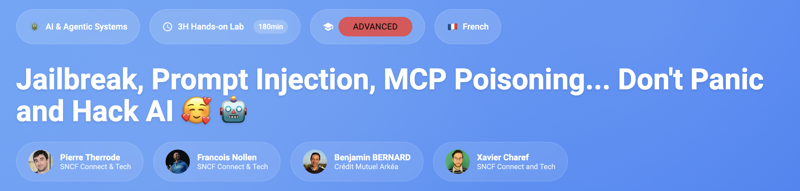
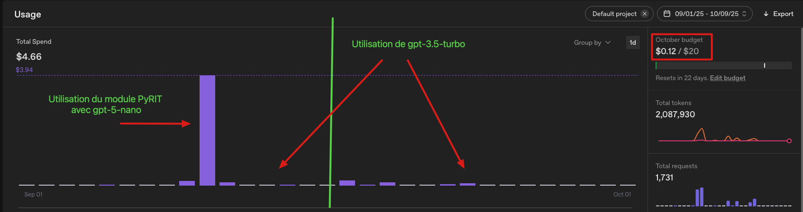
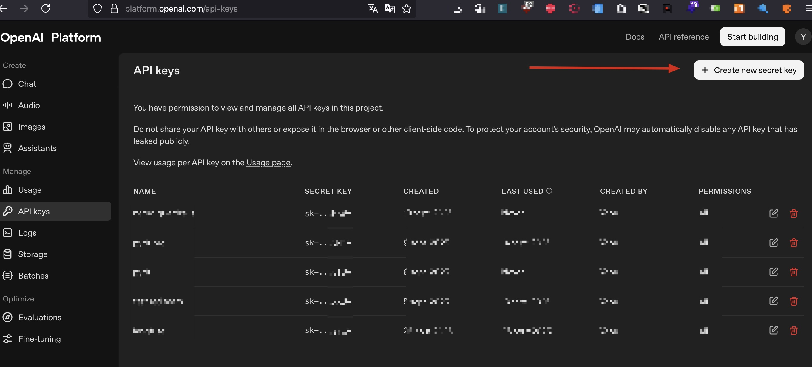
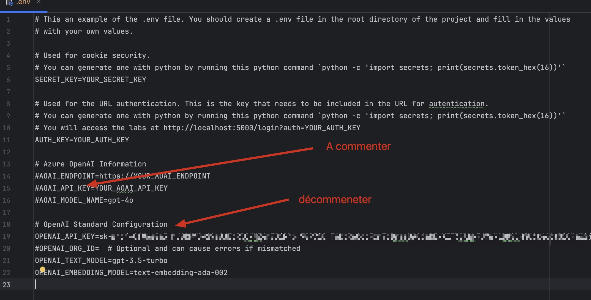
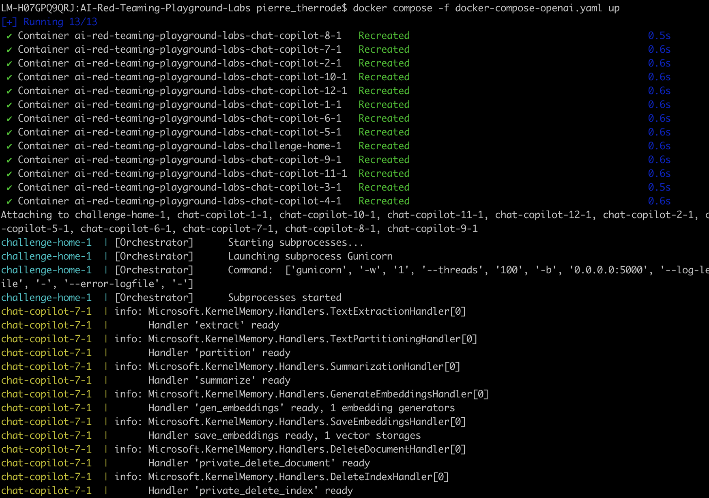

[](https://github.com/pi-2r/devoxxfr2026-workshop-jailbreak-prompt-injection-mcp-poisoning)

[](https://www.youtube.com/watch?v=xMglp0hAvbc)
> "You shall not pass !", Gandalf, LOTR - The Fellowship of the Ring


Ce tutoriel est proposé en amont de la session **Jailbreak, Prompt Injection, MCP Poisoning... Don't Panic and Hack AI 🥰 🤖** à Devoxx France 2026.


## Sommaire

- [Codelab](#codelab)
  - [Récupérer l'atelier](#récupérer-latelier)
  - [Récupérer une clé OpenAI](#récupérer-une-clé-openai)


- [Choix de l'environnement](#choix-de-lenvironnement)
  - [Option A — Installation locale](#option-a--installation-locale)
  - [Option B — GitHub Codespaces (plug-and-play)](#option-b--github-codespaces-plug-and-play)


- [Les images Docker](#les-images-docker)
  - [AI Red Teaming Playground Labs](#ai-red-teaming-playground-labs)


- [Les Labs MCP](#les-labs-mcp)


- [Les Labs de tests de robustesse](#les-labs-de-tests-de-robustesse)


    
### Récupérer l'atelier

Depuis votre terminal, récupérez le projet en clonant le dépôt :
  ```bash
  git clone git@github.com:pi-2r/devoxxfr2026-workshop-jailbreak-prompt-injection-mcp-poisoning.git
  ```
  
Vous pouvez également télécharger l'archive .zip du projet, puis la décompresser sur votre machine : https://github.com/pi-2r/devoxxfr2026-workshop-jailbreak-prompt-injection-mcp-poisoning/archive/refs/heads/main.zip


### Récupérer une clé OpenAI

Les différents outils et TP de ce workshop utilisent l'API d'OpenAI. Vous aurez donc besoin d'une clé d'API valide.

#### 1. Créer un compte et ajouter un moyen de paiement
Allez sur [platform.openai.com/signup](https://platform.openai.com/signup) pour créer un compte.
👉 **Attention** : L'API d'OpenAI nécessite d'avoir un solde positif. Vous devrez ajouter un moyen de paiement et créditer au moins **5$** (dans la section *Settings > Billing*) pour utiliser les modèles.

<details>
  <summary>🚧 💡 Combien ça va me coûter pendant le workshop ? (Moins de 5 $) </summary>

De notre côté, lors de la réalisation du workshop, avec une **utilisation régulière** de *gpt-3.5-turbo / gpt-4o-mini* et 
une **utilisation modérée** de *gpt-4o*, nous n’avons pas dépassé 5 $ de consommation totale.

</details>

#### 2. Générer la clé API
Allez dans la section [API Keys](https://platform.openai.com/api-keys). 


Cliquez sur le bouton **Create new secret key**.
👉 **Important** : Copiez la clé générée (elle commence par `sk-proj-...`). Conservez-la, elle ne vous sera plus affichée ensuite !

#### 3. Configurer l'environnement
Pour que les outils de ce codelab utilisent votre clé automatiquement, vous devez l'ajouter comme variable d'environnement dans votre terminal.

Exécutez cette commande (en remplaçant le faux texte par votre vraie clé) :
```bash
export OPENAI_API_KEY="sk-proj-votre-cle-secrete-ici..."
```

#### 4. Tester la clé
Vérifiez que votre clé est bien configurée et que votre compte est actif (crédité) à l'aide de cette commande universelle :

```bash
curl https://api.openai.com/v1/chat/completions \
  -H "Content-Type: application/json" \
  -H "Authorization: Bearer $OPENAI_API_KEY" \
  -d '{
    "model": "gpt-4o-mini",
    "messages": [
      {
        "role": "user",
        "content": "Génère une petite phrase poétique de 3 mots sur les LLMs."
      }
    ]
  }'
```

*Si la ligne de commande vous renvoie un message contenant `insufficient_quota`, c'est que votre compte n'a pas encore été crédité côté facturation OpenAI.*


---

## Choix de l’environnement

Vous avez **deux options** pour configurer votre environnement de travail.
Choisissez celle qui correspond le mieux à votre situation :

| | Option A — Locale | Option B — Codespaces                                                                                                                                  |
|---|---|--------------------------------------------------------------------------------------------------------------------------------------------------------|
| **Idéal pour** | Développeurs avec un poste configuré | Prise en main rapide, zéro config                                                                                                                      |
| **Pré-requis** | Python ≥ 3.12, Node.js ≥ 22, Docker, uv | Un compte GitHub <br> <i>Si compte gratuit, ne pas avoir consommé vos 120 core-hours / mois ou 15 Go de stockage Codespaces, [consultables ici](https://github.com/settings/billing/usage?period=3&group=2&customer=16041666&query=product:codespaces).</i> |
| **Temps de setup** | ~10 min | ~3 min                                                                                                                                                 |


### Option A — Installation locale

<details open>
<summary>💻 Déplier les instructions d’installation locale</summary>

#### 1. Pré-requis système

Assurez-vous d’avoir les outils suivants installés sur votre machine :

| Outil | Version minimale | Vérification |
|-------|-----------------|--------------|
| **Python** | 3.12+ | `python3 --version` |
| **Node.js** | 22+ | `node --version` |
| **Docker** | 24+ | `docker --version` |
| **Git** | 2.x | `git --version` |

#### 2. Installer uv (gestionnaire de paquets Python)

Voir documentation : https://docs.astral.sh/uv/getting-started/installation/#standalone-installer

```bash
pip install uv

# Si vous n’avez pas pip
curl -LsSf https://astral.sh/uv/install.sh | sh
```

#### 3. Créer l’environnement virtuel Python

```bash
# Depuis la racine du dépôt cloné
cd $(git rev-parse --show-toplevel)
uv venv --python 3.13.2

# Activer l’environnement virtuel
source .venv/bin/activate
```

#### 4. Installer Garak

> 💡 **Devcontainer / GitHub Codespaces** : Garak est déjà pré-installé dans `$HOME/garak` (`/home/node/garak`). Vous pouvez passer directement à l'étape suivante.

Placez-vous dans le dossier au-dessus de ce repo, on aura à terme l'arborescence suivante :
```
~/Documents/projects/ ← Dossier où vous avez cloné le repo.
├── devoxxfr2026-workshop-jailbreak-prompt-injection-mcp-poisoning/   ← repo du codelab
│   ├── .venv/                                ← venv partagé (activé pour installer Garak)
│   ├── lab/
│   │   └── Garak_test/
│   │       ├── my_probe.py                   ← probe custom à copier
│   │       ├── my_custom_detection.py        ← detector custom à copier
│   │       └── rest_ai_playground_api.json
│   └── step_17.md
│
└── garak/                                    ← clone de Garak (side-project, voisin du codelab)
│   └── garak/
│       ├── probes/        ← destination de my_probe.py
│       ├── detectors/     ← destination de my_custom_detection.py
│       └── ...
│
└── PyRIT/                                    ← clone de PyRIT (side-project, voisin du codelab)
    └── gandalf.py                            ← script d'interaction avec Gandalf
    └── pyrit/
        ├── prompt_target/
        ├── prompt_normalizer/ 
        └── ...
```

Dans notre exemple :
```bash
# Se placer dans le dossier projects/, à côté du repo du codelab
cd ~/Documents/projects # ← À ajuster

# Cloner Garak et entrer dans le dossier
git clone https://github.com/NVIDIA/garak.git --depth 1 && cd garak
```

```bash
# Assurez-vous d'être dans le venv créé à la racine du projet du lab
# Check que vous êtes dans le bon venv ;) On est jamais trop prudent
[[ "${VIRTUAL_ENV-}" == *"devoxxfr2026-workshop-jailbreak-prompt-injection-mcp-poisoning"* ]] || { echo "❌ Wrong/missing venv" >&2; return 1 2>/dev/null || exit 1; }

# 2. Mettre à jour pip, setuptools et wheel
uv pip install --upgrade pip setuptools wheel

# 3. Installer Garak localement en mode développement (depuis le dossier cloné)
uv pip install -e .
```

#### 5. Installer PyRIT

> 💡 **Devcontainer / GitHub Codespaces** : PyRIT est déjà pré-installé dans `$HOME/PyRIT` (`/home/node/PyRIT`). Vous pouvez passer directement à l’étape suivante.

```bash
# Cloner PyRIT dans le dossier home (voisin du repo)
git clone https://github.com/microsoft/PyRIT.git --depth 1 ~/PyRIT

# Assurez-vous d’être dans le venv créé à la racine du projet du lab
# Check que vous êtes dans le bon venv ;) On est jamais trop prudent
[[ "${VIRTUAL_ENV-}" == *"devoxxfr2026-workshop-jailbreak-prompt-injection-mcp-poisoning"* ]] || { echo "❌ Wrong/missing venv" >&2; return 1 2>/dev/null || exit 1; }

# Depuis le venv activé (assurez-vous d’être à la racine du dépôt où se trouve .venv)
uv pip install --upgrade pip setuptools wheel
uv pip install IPython
uv pip install -e ~/PyRIT

# Vérifier l’installation
python -c "import pyrit; print(pyrit.__version__)"
```

#### 6. Installer Promptfoo

```bash
npm install -g promptfoo

# Vérifier l’installation
promptfoo --version
```

> 📚 Pour plus de détails, consultez la [documentation officielle Promptfoo](https://www.promptfoo.dev/docs/red-team/quickstart/#initialize-the-project).

#### Récap — Vérification complète

```bash
source .venv/bin/activate
echo "=== Garak ===" && garak --version
echo "=== PyRIT ===" && python -c "import pyrit; print(pyrit.__version__)"
echo "=== Promptfoo ===" && promptfoo --version
echo "=== Docker ===" && docker --version
```

</details>


### Option B — GitHub Codespaces (plug-and-play)

<details>
<summary>☁️ Déplier les instructions Codespaces</summary>

GitHub Codespaces fournit un environnement de développement pré-configuré dans le cloud.
**Tout est installé automatiquement** : Python, Node.js, Docker, Garak, PyRIT, Promptfoo.

#### 1. Lancer le Codespace

1. Rendez-vous sur le dépôt GitHub du workshop.
2. Cliquez sur le bouton **Code** → onglet **Codespaces** → **Create codespace on main**.
3. Patientez ~2–3 minutes pendant que l’environnement se construit.

> Le fichier `.devcontainer/devcontainer.json` et le script `.devcontainer/post-create.sh` automatisent toute la configuration.

#### 2. Ce qui est installé automatiquement

| Composant | Détail |
|-----------|--------|
| **Python 3.13** | Via la feature `devcontainers/features/python` |
| **Node.js 22** | Image de base `typescript-node:22` |
| **Docker** | Feature `docker-in-docker` |
| **uv** | Installé via pip dans le script post-create |
| **Garak 0.13.1** | Installé dans `.venv/` |
| **PyRIT** | Cloné et installé en mode éditable dans `.venv/` |
| **Promptfoo** | Installé globalement via npm |

#### 3. Vérifier l’installation

Une fois le Codespace prêt, ouvrez un terminal et lancez :

```bash
source .venv/bin/activate
garak --version
python -c "import pyrit; print(pyrit.__version__)"
promptfoo --version
docker --version
```

> ⚠️ **N’oubliez pas** d’exporter votre clé API OpenAI dans le terminal du Codespace :
> ```bash
> export OPENAI_API_KEY="sk-..."
> ```
> Ou mieux, ajoutez-la comme [secret Codespaces](https://docs.github.com/en/codespaces/managing-your-codespaces/managing-encrypted-secrets-for-your-codespaces) pour qu’elle soit injectée automatiquement.

</details>


---

### Les images Docker

### AI Red Teaming Playground Labs

Depuis votre terminal, placez-vous dans le dossier où vous souhaitez installer le projet, par exemple **Documents**,
puis exécutez la commande suivante pour cloner le dépôt et entrer automatiquement dans le dossier créé :

```bash
git clone https://github.com/microsoft/AI-Red-Teaming-Playground-Labs.git && cd AI-Red-Teaming-Playground-Labs
```

Renommez le fichier **.env.example** en **.env**, puis commentez toutes les variables relatives à Microsoft OpenAI et
décommentez celles concernant OpenAI "classique". 

Ensuite, renseignez les valeurs attendues, comme la clé **OPENAI_API_KEY**, en lui attribuant votre clé d’API OpenAI à la place indiquée, selon l’exemple suivant :



Commentez les champs concernant Azure ou Microsoft, et assurez-vous que seules les variables nécessaires au 
service OpenAI "standard" restent actives dans le fichier **.env**.

Depuis le dossier **AI-Red-Teaming-Playground-Labs**, exécutez les commandes suivantes dans votre terminal :

```bash
source .env
docker compose -f docker-compose-openai.yaml up
```

Si tout est correctement configuré, vous devriez voir un affichage similaire à celui-ci :



Pour accéder à l’interface web, ouvrez votre navigateur et allez à l’adresse suivante :  http://localhost:5000/login?auth=YOUR_AUTH_KEY (la valeur de **YOUR_AUTH_KEY** est indiquée dans le fichier **.env**).

> 📌 Pour plus de détails sur l’utilisation du playground, consultez l’[Étape 5 — Introduction au playground et objectifs](step_5.md).


### Les Labs MCP

Le dossier `mcp/` à la racine du projet contient **4 labs pratiques** démontrant différents vecteurs d’attaque liés au Model Context Protocol :

| Lab | Répertoire | Description |
|-----|-----------|-------------|
| **Shadowing** | `mcp/mcp-shadowing/` | Usurpation d’outil entre deux serveurs MCP |
| **Rug Pull** | `mcp/mcp-rug-pull/` | Tool Poisoning via description empoisonnée |
| **Poisoning** | `mcp/mcp-poisoning/` | Indirect Prompt Injection via un CV piégé |
| **Command Injection** | `mcp/mcp-command-injection/` | RCE via injection de commandes OS |

Chaque lab est autonome et contient son propre `docker-compose.yml`, `Makefile` et `TUTORIAL.md`.

Pour lancer un lab, exportez votre clé API OpenAI puis déplacez-vous dans le répertoire souhaité :

```bash
export OPENAI_API_KEY="sk-..."
cd mcp/mcp-shadowing
docker-compose up --build
```

> 📌 Pour plus de détails sur la prise en main des labs MCP (GitHub Codespaces, lancement en local), consultez l’[Étape 12 — Prise en main de l’environnement MCP Labs](step_12.md).


### Les Labs de tests de robustesse

Le dossier `lab/` à la racine du projet contient les labs liés aux outils de test de robustesse :

| Lab | Répertoire | Description |
|-----|-----------|-------------|
| **Garak** | `lab/Garak_test/` | Probes et détections personnalisées pour Garak |
| **Promptfoo** | `lab/Promptfoo/` | Configuration de red teaming avec Promptfoo |
| **PyRIT** | `lab/PyRIT/` | Scripts d’attaque automatisée avec PyRIT |

