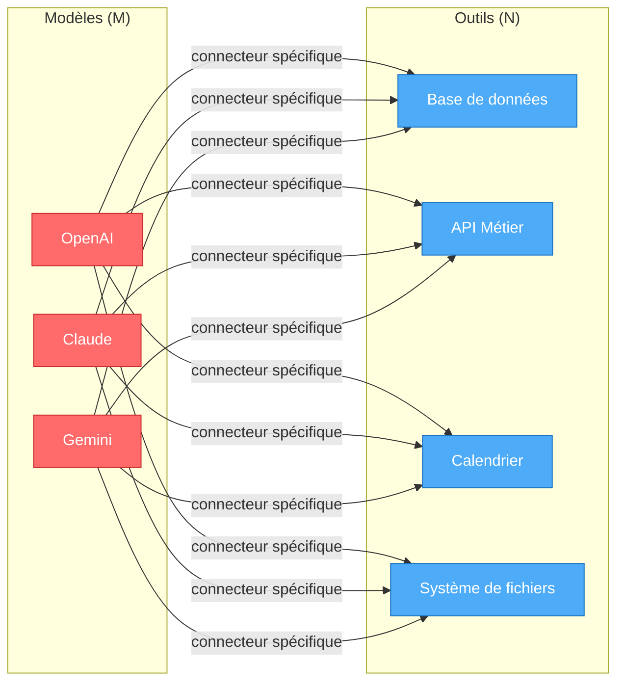
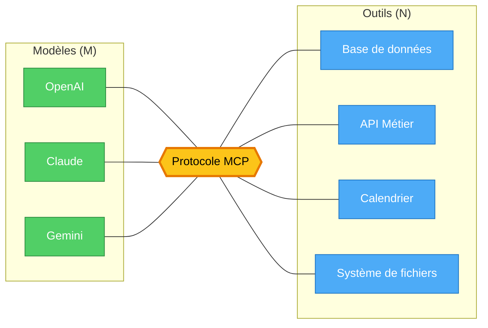
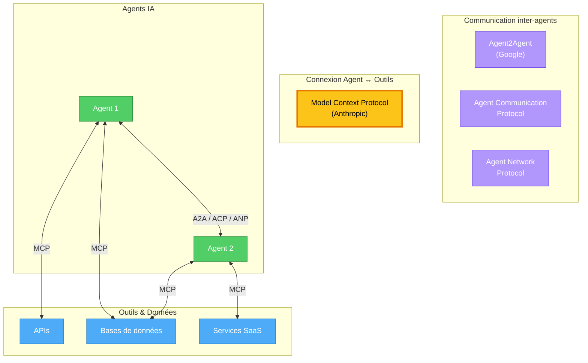
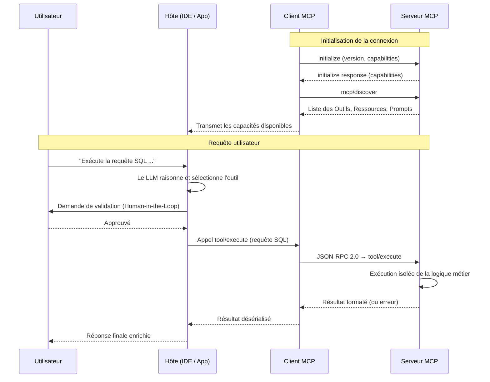
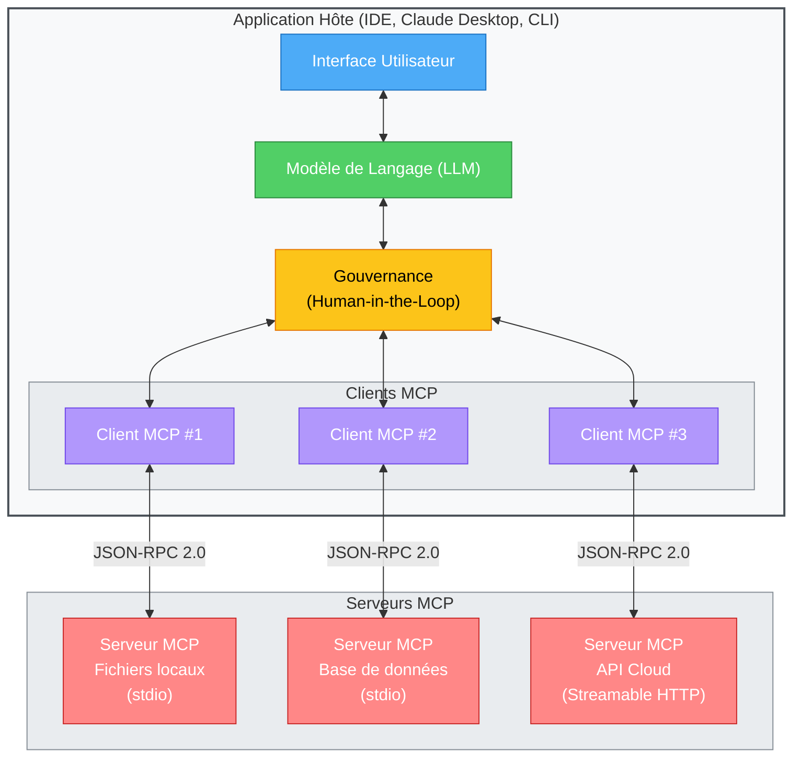
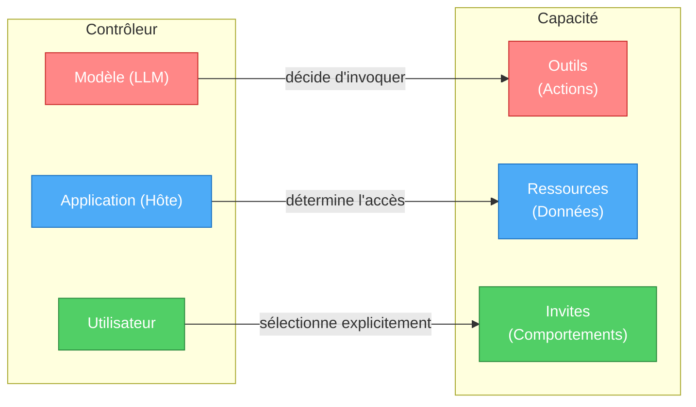

# Le Model Context Protocol : l'infrastructure manquante de l'ère AI-Native

> *"They broke our defenses. They've taken the bridge and the West bank. Battalions of orcs are crossing the river."* — Gandalf, LOTR - The Return of the King

## 🎯 Objectifs de cette étape

- Comprendre le problème de l'intégration des outils dans les LLM
- Comprendre ce qu'est le MCP
- Comprendre comment fonctionne le MCP
- Comprendre les bénéfices stratégiques du MCP
- Comprendre l'avenir du MCP

## Sommaire

- [I. Aux origines du MCP : une crise d'intégration devenue insoutenable](#i-aux-origines-du-mcp--une-crise-dintégration-devenue-insoutenable)
  - [Le problème M×N, ou l'impasse combinatoire](#le-problème-mn-ou-limpasse-combinatoire)
  - [Un coût structurel pour les équipes de développement](#un-coût-structurel-pour-les-équipes-de-développement)
  - [Le précédent Cloud Native : une crise déjà vécue](#le-précédent-cloud-native--une-crise-déjà-vécue)
  - [L'émergence d'un écosystème de protocoles complémentaires](#lémergence-dun-écosystème-de-protocoles-complémentaires)
- [II. Le MCP en substance : standardiser la connexion entre IA et monde réel](#ii-le-mcp-en-substance--standardiser-la-connexion-entre-ia-et-monde-réel)
  - [De la complexité M×N à l'élégance M+N](#de-la-complexité-mn-à-lélégance-mn)
  - [L'agent découplé : distribuer les capacités à grande échelle](#lagent-découplé--distribuer-les-capacités-à-grande-échelle)
  - [Une communication bidirectionnelle par conception](#une-communication-bidirectionnelle-par-conception)
- [III. Architecture du MCP : trois rôles, une séparation stricte des responsabilités](#iii-architecture-du-mcp--trois-rôles-une-séparation-stricte-des-responsabilités)
  - [L'Hôte — le gouverneur de l'interaction](#lhôte--le-gouverneur-de-linteraction)
  - [Le Client MCP — l'intermédiaire technique](#le-client-mcp--lintermédiaire-technique)
  - [Le Serveur MCP — le spécialiste métier](#le-serveur-mcp--le-spécialiste-métier)
- [IV. Le Langage du MCP : Outils, Ressources et Invites](#iv--le-langage-du-mcp--outils-ressources-et-invites)
  - [Les Outils (Tools) — les verbes d'action, contrôlés par le Modèle](#les-outils-tools--les-verbes-daction-contrôlés-par-le-modèle)
  - [Les Ressources (Resources) — les noms de contexte, contrôlés par l'Application](#les-ressources-resources--les-noms-de-contexte-contrôlés-par-lapplication)
  - [Les Invites (Prompts) — la grammaire de la conversation, contrôlée par l'Utilisateur](#les-invites-prompts--la-grammaire-de-la-conversation-contrôlée-par-lutilisateur)
- [V. Ce que le MCP change — et ce qu'il ne résout pas](#v-ce-que-le-mcp-change--et-ce-quil-ne-résout-pas)
- [Étape suivante](#étape-suivante)
- [Ressources](#ressources)

---

## I. Aux origines du MCP : une crise d'intégration devenue insoutenable

Tout commence par une frustration d'ingénieur. Chez Anthropic, [David Soria Parra](https://www.linkedin.com/in/david-soria-parra-4a78b3a/) utilise quotidiennement [Claude Desktop](https://claude.com/fr-fr/download) pour concevoir ses outils de développement. Les allers-retours incessants entre l'assistant IA et son éditeur de code — copier, coller, reformater, recommencer — deviennent un goulot d'étranglement. Une irritation que tout développeur ayant utilisé l'IA avant son intégration native dans les IDE connaît intimement.

Pour y remédier, il puise dans son expérience du [Language Server Protocol (LSP)](https://microsoft.github.io/language-server-protocol/), ce protocole ouvert fondé sur JSON-RPC qui connecte un client à un serveur pour offrir aux IDE des fonctionnalités linguistiques avancées. Autocomplétion contextuelle, affichage des définitions au survol, renommage global de variables : si vous utilisez ces fonctions dans votre éditeur, vous utilisez le LSP. Conçu par Microsoft pour VS Code et standardisé en 2016, il s'est imposé comme la référence de l'industrie.

L'intuition est limpide : ce qui a fonctionné pour les éditeurs de code peut fonctionner pour l'IA.

### Le problème M×N, ou l'impasse combinatoire

En cherchant à résoudre son propre irritant, David Soria Parra met le doigt sur un défi bien plus large — ce que l'industrie appelle le **problème M×N**.

Le principe est simple à énoncer, redoutable à gérer. Une entreprise déploie **M** modèles d'IA (Gemini, Claude, un modèle OpenAI) et souhaite les connecter à **N** outils ou sources de données (une base de données, une API métier, un calendrier). Chaque combinaison exige un connecteur dédié. Cinq modèles, trois outils : **quinze intégrations distinctes** à développer, tester et maintenir.

Le nœud du problème réside dans la fragmentation des interfaces. Chaque fournisseur impose ses propres conventions :

- **OpenAI** requiert des schémas JSON structurés pour la définition des outils ;
- **Anthropic (Claude)** s'appuie sur des balises de type XML ;
- **Google Gemini** exige ses propres structures et SDK propriétaires.

Résultat : un outil parfaitement opérationnel dans un écosystème devient inutilisable dans un autre sans réécriture intégrale de son interface. L'interopérabilité n'existe tout simplement pas.

> **Le problème M×N en un schéma :**

> *3 modèles × 4 outils = **12 connecteurs** à développer et maintenir. Chaque ajout de modèle ou d'outil multiplie la complexité.*

### Un coût structurel pour les équipes de développement

Cette fragmentation impose une **charge cognitive considérable**. Les développeurs jonglent entre des méthodes d'authentification, des modèles de gestion d'état et des stratégies de traitement d'erreurs radicalement différents d'un fournisseur à l'autre. L'architecture résultante s'apparente à un château de cartes : la moindre modification d'interface par un fournisseur menace la stabilité de l'ensemble.

La **dette technique** s'accumule mécaniquement. Chaque équipe est prisonnière d'une maintenance perpétuelle, mobilisée par des correctifs urgents plutôt que par l'innovation. Un nouvel outil de détection de fraude ? Il faudra le décliner en autant de versions qu'il y a de modèles déployés. La mutualisation est paralysée, l'innovation freinée.

C'est précisément ici que l'héritage du LSP prend tout son sens. David Soria Parra comprend qu'un protocole standardisé peut transformer cette impasse combinatoire **M×N** en une équation linéaire **M+N**. Un seul connecteur par LLM, un seul connecteur par outil. Le reste est affaire de protocole.

> **La solution M+N avec le MCP :**

> *3 modèles + 4 outils = **7 connecteurs**. Chaque nouveau LLM ou outil ne nécessite qu'un seul connecteur supplémentaire.*

Il partage cette vision avec **Justin Spahr-Summers**. Ensemble, ils posent les fondations du MCP. Lors d'un hackathon interne chez Anthropic, plusieurs équipes s'emparent immédiatement du concept pour développer de nouvelles intégrations Claude Desktop. L'engouement est organique, spontané — il préfigure le succès public qui suivra un mois plus tard.

Avant même le lancement officiel, Anthropic accorde un accès anticipé à plusieurs éditeurs. Dès sa publication, le protocole est déjà intégré dans des IDE majeurs comme VS Code et dans de nombreux outils du quotidien développeur. Cette stratégie de déploiement "clé en main", combinée à la simplicité de création de serveurs MCP, propulse l'adoption à une vitesse remarquable.

Cette accessibilité a toutefois un revers. Dans la précipitation, de nombreux serveurs sont déployés avec des vulnérabilités critiques : authentification absente, exposition de données sensibles, dysfonctionnements en cascade.

> **Lectures complémentaires :**
> - [Dark Reading — Agentic AI Risky MCP Backbone Attack Vectors](https://www.darkreading.com/application-security/agentic-ai-risky-mcp-backbone-attack-vectors)
> - [Le Monde Informatique — Le piratage du logiciel médical de Cegedim refait surface](https://www.lemondeinformatique.fr/actualites/lire-le-piratage-du-logiciel-medical-de-cegedim-refait-surface-99493.html)
> - [Invariant Labs — MCP GitHub Vulnerability](https://invariantlabs.ai/blog/mcp-github-vulnerability)
> - [Noma Security — AI Agent Vulnerability in LangSmith](https://noma.security/blog/how-an-ai-agent-vulnerability-in-langsmith-could-lead-to-stolen-api-keys-and-hijacked-llm-responses/)

Loin de freiner l'élan, ces défis de jeunesse catalysent l'organisation de la communauté. Les développeurs se rassemblent sur des espaces dédiés — [r/mcp](https://www.reddit.com/r/mcp), [r/modelcontextprotocol](https://www.reddit.com/r/modelcontextprotocol), serveurs Discord communautaires — pour partager leurs retours d'expérience, établir des bonnes pratiques de sécurité et contribuer à la maturation de la spécification.

### Le précédent Cloud Native : une crise déjà vécue

Ce scénario n'est pas inédit. L'IA traverse aujourd'hui la même crise de croissance que l'informatique Cloud il y a une dizaine d'années.

Dans les années 2010, la conteneurisation (popularisée par Docker) révolutionne le déploiement logiciel. Mais l'orchestration à grande échelle plonge l'industrie dans le chaos. **Docker Swarm**, **Apache Mesos** et d'autres solutions concurrentes se disputent la domination. Les entreprises investissent dans une plateforme et se retrouvent captives — le fameux *vendor lock-in*. L'absence de standard commun génère de la friction, ralentit l'adoption et fragmente les compétences.

Puis **Kubernetes** émerge. Un langage commun. Un standard universel. Les briques technologiques s'emboîtent enfin. L'industrie entre dans l'ère [**Cloud Native**](https://aws.amazon.com/fr/what-is/cloud-native/) : microservices, CI/CD, DevOps deviennent des pratiques dominantes, portées par un écosystème unifié et interopérable.

**Le MCP joue aujourd'hui pour l'IA le rôle que Kubernetes a joué pour le Cloud.** Il pose l'infrastructure de communication indispensable pour entrer dans l'ère **AI-Native** — une ère où l'intelligence artificielle n'est plus un gadget greffé à une application existante, mais le cœur d'un système capable de raisonner, d'apprendre et d'agir de manière autonome.

### L'émergence d'un écosystème de protocoles complémentaires

Le succès du MCP a ouvert la voie à d'autres initiatives. Là où le MCP standardise l'accès d'un LLM à ses outils et données, de nouveaux protocoles se spécialisent dans la **communication entre agents**.

L'initiative la plus significative est le protocole **Agent2Agent (A2A)** de Google ([blog officiel](https://developers.googleblog.com/en/a2a-a-new-era-of-agent-interoperability/)). Ses concepteurs l'affirment sans ambiguïté : A2A ne concurrence pas le MCP, il le complète. Dans une architecture moderne, le MCP connecte un agent à ses outils externes ; l'A2A lui permet de collaborer, de se synchroniser et de déléguer des tâches à d'autres agents.

Deux autres initiatives méritent l'attention :

- **[Agent Communication Protocol](https://agentcommunicationprotocol.dev/introduction/welcome)** — une API RESTful standardisée qui permet à des agents hétérogènes (architectures et modèles différents) de coopérer de manière fluide.
- **[Agent Network Protocol](https://agent-network-protocol.com/)** — développé en Chine, ce protocole intègre nativement la gestion des identités, l'authentification et le chiffrement des communications inter-agents.

L'écosystème se structure. Le MCP en constitue la couche fondamentale.

> **Positionnement des protocoles dans l'écosystème Agentic AI :**

---

## II. Le MCP en substance : standardiser la connexion entre IA et monde réel

Le Model Context Protocol n'a pas été conçu pour résoudre un simple problème de copier-coller. Son ambition est structurelle : **définir un standard universel** pour la manière dont les modèles de langage se connectent au monde extérieur.

En découplant la logique d'intégration du code applicatif, le MCP offre une interface commune qui simplifie radicalement la création, la découverte et la distribution de nouvelles capacités pour l'IA.

### De la complexité M×N à l'élégance M+N

L'IA générative confère aux applications des capacités remarquables : interroger une base de données, analyser un calendrier, produire du code. Historiquement, chaque capacité exigeait une intégration sur mesure, étroitement couplée au code de l'application principale. L'ajout de chaque nouveau modèle ou de chaque nouvel outil multipliait les connecteurs à développer et à maintenir.

Le MCP introduit une **couche intermédiaire standardisée** qui transforme cette complexité exponentielle en une équation linéaire. L'architecture passe de **M×N** connecteurs à **M+N** : les développeurs d'applications implémentent le client MCP une seule fois, les créateurs d'outils développent leur serveur MCP une seule fois. L'ensemble fonctionne immédiatement.

> Le MCP est souvent comparé à un **"USB-C de l'IA"** — un connecteur universel qui permet à n'importe quel LLM de découvrir et d'utiliser instantanément n'importe quel outil, sans adaptateur propriétaire.

### L'agent découplé : distribuer les capacités à grande échelle

Jusqu'à récemment, les outils développés pour les agents IA restaient enfermés dans des silos : spécifiques à un environnement, difficiles à réutiliser, impossibles à distribuer largement.

Le MCP change la donne en introduisant le principe de **l'agent découplé**. L'interface de communication étant unifiée, les intégrations sont physiquement séparées du code de l'agent. Celui-ci se concentre sur son rôle cognitif — raisonnement et prise de décision — tandis que les serveurs MCP assument l'accès aux capacités externes et la manipulation des données.

Ce découplage produit un **effet multiplicateur** considérable. N'importe quel développeur peut rendre ses données ou ses API "compatibles IA" en publiant un simple serveur MCP. Au sein d'une grande organisation, les équipes créent et maintiennent leurs propres serveurs en parallèle, faisant émerger un véritable **marché d'outils interne** qui standardise les ressources à l'échelle de l'entreprise.

### Une communication bidirectionnelle par conception

Le MCP repose sur le standard de messagerie **JSON-RPC 2.0** et exige une communication bidirectionnelle robuste. Un serveur MCP ne se limite pas à publier une liste d'outils de manière passive : il reçoit des instructions d'exécution du LLM et peut, en retour, émettre des requêtes ou des notifications de mise à jour vers l'application hôte.

Pour gérer la mécanique fine de ces échanges — maintien de connexion, routage des messages, gestion des erreurs — le protocole s'appuie sur deux **couches de transport** standardisées :

- **Standard I/O (stdio)** — pour la communication locale, lorsqu'un serveur MCP s'exécute en tant que processus enfant sur la même machine que l'application hôte (typiquement, un outil intégré à votre IDE).
- **Streamable HTTP** — le standard recommandé pour les communications distantes. Il utilise des requêtes HTTP classiques pour l'envoi et une connexion persistante pour la réception de flux de données, permettant de connecter de manière sécurisée une application à des serveurs MCP hébergés dans le cloud.

> **Flux de communication type entre un Hôte et un Serveur MCP :**

---

## III. Architecture du MCP : trois rôles, une séparation stricte des responsabilités

La puissance du MCP repose sur un principe architectural rigoureux : la **séparation des préoccupations** (*control segregation*). Chaque composant du système détient une responsabilité bien définie, garantissant à la fois sécurité et modularité.

Le système s'articule autour de trois rôles fondamentaux.

> **Vue d'ensemble de l'architecture MCP :**

> *Chaque Client MCP gère la relation avec un seul Serveur. L'Hôte orchestre l'ensemble et impose la validation humaine avant toute action sensible.*

### L'Hôte — le gouverneur de l'interaction

L'Hôte est l'application utilisateur au sein de laquelle l'IA opère. Un IDE dopé à l'intelligence artificielle (Cursor, Windsurf), une application conversationnelle (Claude Desktop), un terminal intelligent (Warp, Gemini CLI) : tous assument ce rôle. Bien qu'il ne figure pas dans la spécification stricte du protocole, l'Hôte est l'environnement sans lequel rien ne fonctionne.

Ses responsabilités sont doubles et critiques :

- **Gestion de l'expérience et de l'état** — L'Hôte pilote l'interface, conserve l'historique complet de la conversation et restitue les réponses finales de l'IA à l'utilisateur.
- **Gouvernance et sécurité** — C'est la fonction la plus déterminante. L'Hôte est le gardien ultime des capacités de l'agent. Il contrôle les ressources accessibles selon le contexte (par exemple, restreindre l'accès au seul répertoire du projet en cours) et impose la **validation humaine** (*Human-in-the-Loop*). Avant toute action irréversible — suppression de fichier, modification d'une base de données — il intercepte la requête et exige l'approbation explicite de l'utilisateur.

### Le Client MCP — l'intermédiaire technique

Le Client MCP est le rouage invisible qui rend la communication possible. Intégré au sein de l'Hôte, chaque instance gère la relation technique avec un Serveur MCP spécifique (un Client par Serveur connecté).

Trois fonctions définissent son périmètre :

- **Gestion du cycle de vie** — Le Client initialise la connexion, sélectionne le transport approprié (local ou distant) et gère proprement la fermeture de session ou les erreurs réseau.
- **Traduction protocolaire** — Il convertit automatiquement les objets natifs de l'application Hôte en messages JSON-RPC 2.0 conformes au MCP, et inversement. Les développeurs n'ont jamais à manipuler le protocole directement.
- **Découverte dynamique** — Dès la connexion établie, le Client interroge le Serveur (via `mcp/discover`) pour récupérer l'intégralité de ses capacités — Outils, Ressources, Prompts — et les transmettre à l'Hôte. C'est ce mécanisme qui permet aux agents de découvrir de nouvelles compétences à la volée, sans configuration manuelle.

### Le Serveur MCP — le spécialiste métier

Le Serveur est le composant qui détient la capacité technique réelle. C'est une enveloppe (*wrapper*) autour d'une fonctionnalité spécifique — base de données SQLite, API d'entreprise, système de fichiers, service SaaS — exposée au monde extérieur via l'interface standardisée du MCP.

Trois caractéristiques le distinguent :

- **Modularité extrême** — Un Serveur MCP peut prendre des formes très diverses : un script Python de 20 lignes s'exécutant localement, un microservice déployé sur un cluster Kubernetes, ou une API publique proposée par GitHub ou Slack. La barrière d'entrée est volontairement basse.
- **Exposition déclarative** — Le Serveur écoute passivement les requêtes de Clients autorisés. Lorsqu'il est interrogé, il annonce ses compétences via des descriptions textuelles détaillées, conçues pour guider le raisonnement du LLM dans sa sélection d'outils.
- **Exécution isolée** — À la réception d'un ordre valide (exécuter une requête SQL, par exemple), le Serveur décode la demande, exécute sa logique métier de manière autonome, puis renvoie un résultat formaté — ou une erreur explicite — au Client. Il n'a à aucun moment besoin de connaître le modèle d'IA à l'origine de la requête. Cette isolation est une garantie architecturale de portabilité et de sécurité.

## IV.  Le Langage du MCP : Outils, Ressources et Invites

Au-delà de la connexion technique, le MCP définit un **vocabulaire** — un ensemble structuré de capacités que chaque Serveur expose à l'application Hôte. Là où le Language Server Protocol se limitait aux fonctions liées au code (autocomplétion, navigation vers les définitions), le MCP embrasse un spectre considérablement plus large : interroger une base de données, piloter un pipeline CI/CD, analyser un corpus documentaire.

Ces capacités se répartissent en trois catégories. Leur classification n'est pas un choix taxonomique anodin : elle obéit à un **principe fondamental de ségrégation du contrôle**. Chaque catégorie est gouvernée par une entité distincte — le Modèle, l'Application ou l'Utilisateur — afin de prévenir toute escalade de privilèges non supervisée.

### Les Outils (*Tools*) — les verbes d'action, contrôlés par le Modèle

Les Outils incarnent la capacité d'agir. Ce sont des fonctions exécutables — rechercher sur le web, lancer une requête SQL, déclencher un déploiement — que le Serveur MCP met à disposition de l'IA.

Leur fonctionnement repose sur un mécanisme déclaratif : le Serveur publie la liste exhaustive de ses outils, accompagnée de descriptions textuelles suffisamment précises pour guider le raisonnement du LLM. Le Modèle d'IA analyse ensuite cette liste et décide, **de sa propre initiative**, s'il est pertinent d'invoquer un outil pour répondre à la requête de l'utilisateur.

> C'est cette autonomie de sélection qui confère à l'agent sa dimension véritablement agentique. Le LLM ne se contente pas de répondre : il *agit*.

### Les Ressources (*Resources*) — les noms de contexte, contrôlés par l'Application

Les Ressources représentent les données brutes en lecture seule : fichiers texte, documents PDF, schémas de base de données, extraits de code source. Elles constituent le **socle factuel** sur lequel l'IA construit son raisonnement.

L'Application Hôte peut injecter ces données dans le contexte du LLM, ou un Outil peut s'en servir comme matière première pour ses opérations. Mais le point critique réside dans le contrôle d'accès : c'est **l'Application Hôte** — et elle seule — qui détermine quelles Ressources sont accessibles. Un IDE restreindra l'accès au seul répertoire du projet ouvert ; une interface conversationnelle limitera les documents consultables à ceux explicitement partagés par l'utilisateur.

> Le principe est limpide : aucune IA ne doit pouvoir décider unilatéralement d'explorer l'intégralité d'un système de fichiers. L'Hôte garantit un périmètre de données strictement borné.

### Les Invites (*Prompts*) — la grammaire de la conversation, contrôlée par l'Utilisateur

Les Invites sont des modèles de conversation pré-configurés par le Serveur MCP. Elles définissent un comportement, un format de réponse ou un *persona* spécifique pour une tâche donnée — par exemple, « Agir comme un relecteur de code senior » ou « Produire une analyse de vulnérabilité au format SARIF ».

Leur rôle est de **standardiser l'interaction** entre l'IA et un service spécifique, garantissant des requêtes optimisées et des réponses structurées. Contrairement aux Outils, le LLM ne choisit jamais d'activer une Invite de lui-même. C'est **l'Utilisateur** qui la sélectionne délibérément via l'interface de l'Hôte (menu déroulant, commande slash, raccourci clavier), conservant ainsi un contrôle explicite sur la posture adoptée par l'IA.

> **Synthèse du modèle de contrôle :**

> *Cette ségrégation tripartite du contrôle constitue l'un des choix architecturaux les plus déterminants du MCP. En distribuant l'autorité entre trois acteurs distincts, le protocole empêche tout composant unique — y compris le LLM lui-même — de concentrer un pouvoir d'action incontrôlé.*

## V. Ce que le MCP change — et ce qu'il ne résout pas

Le Model Context Protocol marque un tournant structurel. En posant une couche de communication universelle entre les modèles de langage et le monde extérieur, il transforme une impasse combinatoire en un écosystème modulaire, interopérable et distribuable à grande échelle. L'analogie avec Kubernetes n'est pas rhétorique : elle décrit un mécanisme historique identique — un standard ouvert qui déverrouille une industrie entière.

Trois acquis fondamentaux se dégagent de cette analyse :

- **La fin du couplage fort.** Les intégrations ne sont plus prisonnières du code applicatif. Un serveur MCP développé une fois fonctionne avec n'importe quel client conforme — aujourd'hui un IDE, demain un agent autonome déployé en production.
- **Une gouvernance par conception.** La ségrégation tripartite du contrôle (Modèle, Application, Utilisateur) n'est pas un dispositif de sécurité ajouté après coup. Elle est inscrite dans l'architecture même du protocole, imposant des frontières claires entre autonomie de l'IA, accès aux données et intention humaine.
- **Un effet de réseau naissant.** Chaque nouveau serveur MCP publié enrichit l'ensemble de l'écosystème. Chaque nouveau client conforme multiplie instantanément les capacités accessibles. La dynamique est celle d'une plateforme, pas d'un outil.

Mais cette puissance s'accompagne de risques considérables. La facilité de création de serveurs MCP — quelques dizaines de lignes de code suffisent — a engendré un écosystème où la rapidité de déploiement a souvent primé sur la rigueur sécuritaire. Authentification absente, descriptions d'outils manipulables, données sensibles exposées sans contrôle d'accès : les vecteurs d'attaque sont réels, documentés et exploités.

> C'est précisément ce terrain — la surface d'attaque ouverte par le MCP — que nous allons explorer dans les étapes suivantes de ce workshop. Car comprendre l'infrastructure, c'est aussi comprendre où elle se brise.

## Étape suivante

- [Étape 12](step_12.md)

## Ressources

| Information                                                                       | Lien                                                                                                                                                                                                         |
|-----------------------------------------------------------------------------------|--------------------------------------------------------------------------------------------------------------------------------------------------------------------------------------------------------------|
| The Creators of Model Context Protocol                                            | [https://www.youtube.com/watch?v=m2VqaNKstGc](https://www.youtube.com/watch?v=m2VqaNKstGc)                                                                                                                   |
| Design Multi-Agent AI Systems Using MCP and A2A                                   | [https://www.packtpub.com/en-sg/product/design-multi-agent-ai-systems-using-mcp-and-a2a-9781806116461](https://www.packtpub.com/en-sg/product/design-multi-agent-ai-systems-using-mcp-and-a2a-9781806116461) |
| The MCP Standard                                                                  | [https://link.springer.com/book/10.1007/979-8-8688-2364-0](https://link.springer.com/book/10.1007/979-8-8688-2364-0)                                                                                         |
| Securing AI Agents                                                                | [https://link.springer.com/book/10.1007/978-3-032-02130-4](https://link.springer.com/book/10.1007/978-3-032-02130-4)                                                                                         |
| AI Agents with MCP                                                                | [https://learning.oreilly.com/library/view/ai-agents-with/9798341639546/](https://learning.oreilly.com/library/view/ai-agents-with/9798341639546/)                                                           |
| Model Context Protocol (MCP) Masterclass                                          | [https://learning.oreilly.com/course/model-context-protocol/9781807302979/](https://learning.oreilly.com/course/model-context-protocol/9781807302979/)                                                       |
| Documentation sur la partie transport                                             | [https://modelcontextprotocol.io/specification/2025-03-26/basic/transports](https://modelcontextprotocol.io/specification/2025-03-26/basic/transports)                                                       |
| MCP is not REST API                                                               | [https://leehanchung.github.io/blogs/2025/05/17/mcp-is-not-rest-api/](https://leehanchung.github.io/blogs/2025/05/17/mcp-is-not-rest-api/)                                                                                                                   |
