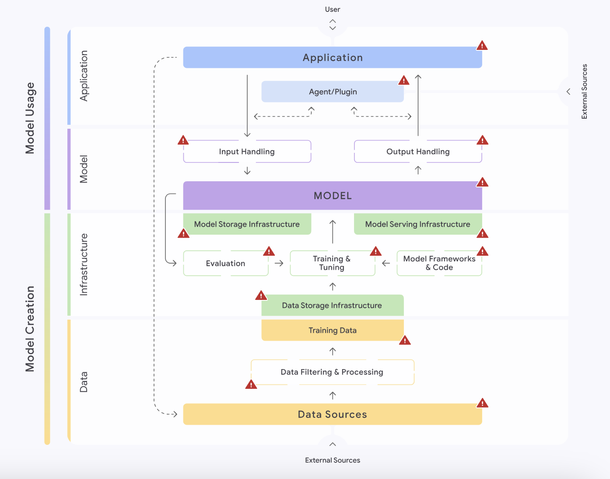
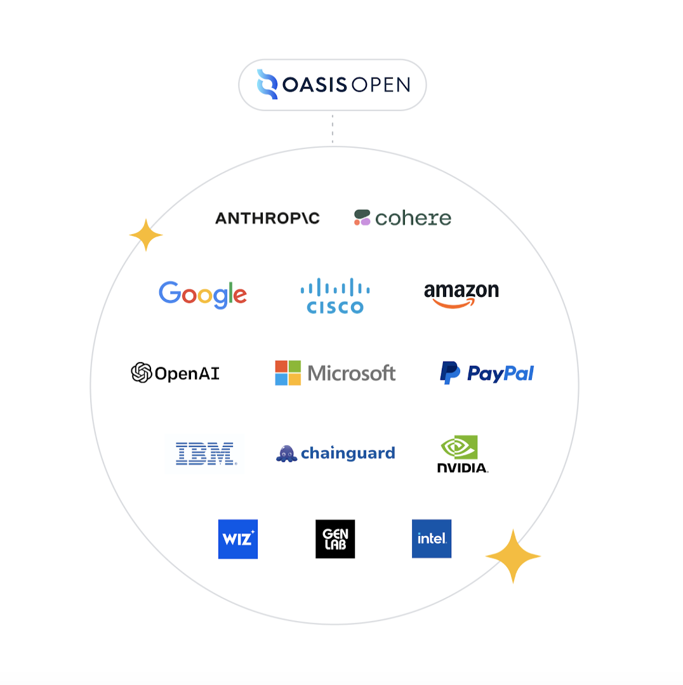

# Cadres de sécurité référents

> "if you want him come and claim him", Arwen, LOTR - The Fellowship of the Ring

## 🎯 Objectifs de cette étape
- Comprendre les cadres de sécurité existants pour les LLM (modèles de langage de grande taille)
- Identifier les principaux risques et vulnérabilités liés à l’utilisation des LLM
- Découvrir les frameworks et référentiels de sécurité dédiés (OWASP Top 10 LLM, SAIF, MITRE ATLAS)
- Appréhender les réglementations législatives encadrant les LLM (États-Unis, Union européenne)
- Accéder à des ressources pour approfondir la sécurisation des applications IA

## Sommaire

- [OWASP Top 10 for LLM Applications](#owasp-top-10-for-llm-applications)
  - [Plus en détail](#plus-en-détail)

- [Soyez SAIF avec le Secure AI Framework](#soyez-saif-avec-le-secure-ai-framework)
  - [Cadre Secure AI Framework (SAIF) de Google](#cadre-secure-ai-framework-saif-de-google)
  - [Les quatre grandes catégories du SAIF](#les-quatre-grandes-catégories-du-saif)
  - [Les six éléments fondamentaux du SAIF](#les-six-éléments-fondamentaux-du-saif)
  - [Cartographie des risques et contrôles SAIF](#cartographie-des-risques-et-contrôles-saif)
  - [Mise en œuvre et communauté SAIF](#mise-en-œuvre-et-communauté-saif)

- [MITRE ATLAS, le fil d'Ariane des techniques d'attaque sur l'IA](#mitre-atlas-le-fil-dariane-des-techniques-dattaque-sur-lia)
  - [Objectif du MITRE ATLAS](#objectif-du-mitre-atlas)
  - [Cadre de référence](#cadre-de-référence)
  - [Éléments fondamentaux du MITRE ATLAS](#éléments-fondamentaux-du-mitre-atlas)
  - [Comment l'utiliser](#comment-lutiliser)

- [Réglementation législative des LLM](#réglementation-législative-des-llm)
    - [Enjeux et principes](#enjeux-et-principes)
      - [États-Unis: une régulation sectorielle et centrée sur la liberté d’expression](#états-unis-une-régulation-sectorielle-et-centrée-sur-la-liberté-dexpression)
      - [Union européenne: un encadrement structuré et fondé sur les risques](#union-européenne-un-encadrement-structuré-et-fondé-sur-les-risques)
        - [Digital Services Act (DSA)](#digital-services-act-dsa)
        - [AI Act](#ai-act)
    - [Points de convergence et divergences](#points-de-convergence-et-divergences)

- [Étape suivante](#étape-suivante)
- [Ressources](#ressources)

## OWASP Top 10 for LLM Applications

<a href="https://genai.owasp.org/2023/10/18/llm-to-10-v1-1/" target="_blank"><em>source: genai.owasp.org</em></a>

L’**OWASP Top 10 for Large Language Model Applications** est aujourd’hui l’outil de référence pour recenser, analyser et 
atténuer les principaux risques de sécurité propres à l’utilisation des grands modèles de langage.

Cette liste élaborée collectivement constitue un guide incontournable pour les développeurs, architectes et responsables 
de la sécurité désireux d’intégrer l’IA générative de manière fiable et sécurisée dans leurs systèmes d’information. 
Ce classement a vu le jour grâce à l’engagement de [John Sotiropoulos](https://www.linkedin.com/in/jsotiropoulos/), 
co-pilote du projet, et d’[Ads Dawson](https://www.linkedin.com/in/adamdawson0/), responsable technique en charge de la 
coordination de la rédaction des aspects techniques du référentiel.

Voici une synthèse de l'OWASP Top 10 for LLM Applications 2025 :

| IDENTIFIANT | Description                                                                                                                                                                                                                    |
|-------------|--------------------------------------------------------------------------------------------------------------------------------------------------------------------------------------------------------------------------------|
| **LLM01**   | **Injection de prompt** : Les attaquants manipulent l'entrée du LLM directement ou indirectement pour provoquer un comportement malveillant ou illégal.                                                                        |
| **LLM02**   | **Divulgation d’informations sensibles** : Les attaquants trompent le LLM pour qu'il révèle des informations sensibles dans sa réponse.                                                                                        |
| **LLM03**   | **Vulnérabilités de la chaîne d'approvisionnement** : Les attaquants exploitent des vulnérabilités dans n’importe quelle partie de la chaîne d’approvisionnement du LLM.                                                       |
| **LLM04**   | **Empoisonnement des données et du modèle** : Les attaquants injectent des données malveillantes ou trompeuses dans les données d'entraînement du LLM, compromettant ses performances ou créant des portes dérobées.           |
| **LLM05**   | **Gestion non sécurisée de la sortie** : La sortie du LLM est gérée de manière non sécurisée, entraînant des vulnérabilités d'injection telles que le Cross-Site Scripting (XSS), l'injection SQL ou l'injection de commandes. |
| **LLM06**   | **Accès excessif (agency)** : Les attaquants exploitent l’accès insuffisamment restreint du LLM à des systèmes ou à des actions sensibles.                                                                                     |
| **LLM07**   | **Fuite du prompt système** : Les informations sensibles contenues dans les prompts système sont accidentellement divulguées.                                                                                                  |
| **LLM08**   | **Vulnérabilités sur les vecteurs et embeddings** : Exploitation des faiblesses dans la gestion des vecteurs et embeddings en systèmes RAG, causant fuite ou altération de données.                                            |
| **LLM09**   | **Désinformation** : Le LLM génère des informations fausses ou trompeuses, provoquant des risques de sécurité et réputationnels.                                                                                               |
| **LLM10**   | **Consommation illimitée (Unbounded Consumption)** : Des attaques exploitent la consommation excessive de ressources, entraînant déni de service ou coûts financiers.                                                          |

### Plus en détail

  
Injection de prompt (LLM01)

L’injection de prompt est une vulnérabilité de sécurité qui survient lorsqu’un utilisateur malintentionné parvient à 
manipuler les instructions fournies en entrée à un modèle de langage (LLM), l’amenant ainsi à adopter un comportement 
imprévu ou non désiré.

Si certaines manipulations peuvent paraître anodines — par exemple, détourner un chatbot d’assistance technique pour lui 
faire donner des recettes de cuisine — d’autres peuvent avoir des conséquences bien plus graves. Cette technique peut 
être exploitée pour inciter le LLM à produire de fausses informations, des discours haineux ou encore du contenu 
nuisible, voire illégal.

Dans certains cas, l’injection de prompt peut également permettre à un attaquant d’extraire des données sensibles 
précédemment communiquées au modèle, compromettant ainsi la confidentialité des informations traitées.

  
Divulgation d’informations sensibles (LLM02)

Les modèles de langage (LLM) peuvent, de manière involontaire, divulguer des données confidentielles dans leurs réponses.
Une telle exposition peut entraîner un accès non autorisé à des informations sensibles, des atteintes à la vie privée,
voire des failles de sécurité. Il est donc essentiel de restreindre strictement l'accès aux informations que le LLM est
autorisé à consulter.

Cela est particulièrement important lorsque le modèle est utilisé pour traiter des données sensibles ou stratégiques,
comme des informations clients. Dans ces cas, les requêtes adressées au LLM doivent faire l’objet de contrôles d’accès
rigoureux afin de limiter le risque de fuite de données.

Si le LLM a été entraîné ou affiné à l’aide d’un jeu de données personnalisé, il est crucial de garder à l’esprit qu’il
peut être manipulé (par des attaques d'injection de prompt, par exemple) pour révéler des éléments de ces données
d’apprentissage. Ainsi, toute information sensible intégrée au corpus d’entraînement doit être soigneusement identifiée,
évaluée en fonction de sa criticité, et protégée en conséquence.

De plus, les données sensibles fournies au LLM via des "prompts" utilisateurs peuvent être exposées par des attaques
d’injection (voir LLM01), même si l’on a explicitement demandé au modèle de garder ces informations confidentielles.
Cela souligne la nécessité de mettre en place des mesures de sécurité adaptées à chaque point de contact entre
l’utilisateur et le modèle.

 
 

  
Vulnérabilités de la chaîne d'approvisionnement (LLM03)

Les vulnérabilités de la chaîne d’approvisionnement dans le contexte des LLM concernent tous les éléments impliqués dans
leur développement ou leur déploiement. Cela inclut notamment les jeux de données utilisés pour l’entraînement (voir LLM03),
les modèles préentraînés fournis par des tiers, ainsi que les plugins, extensions ou autres systèmes interagissant
avec le LLM (cf. LLM07).

L’impact de ces vulnérabilités peut varier considérablement, allant de simples dysfonctionnements à des conséquences
critiques. L’un des scénarios les plus courants est la fuite de données sensibles ou la divulgation de propriété
intellectuelle, compromettant la confidentialité ou les actifs stratégiques de l’organisation.

  
Empoisonnement des données et du modèle (LLM04)

La qualité et les performances d’un modèle de langage (LLM) dépendent en grande partie des données utilisées durant sa
phase d'entraînement. L’empoisonnement des données d’entraînement (Training Data Poisoning) consiste à manipuler tout
ou partie de ces données afin d’introduire des biais volontaires, incitant le modèle à produire des résultats incorrects
ou malveillants.

Selon l’usage du LLM ainsi compromis, les conséquences peuvent aller d’une perte de crédibilité à des vulnérabilités
critiques en matière de sécurité, notamment si le modèle génère du code réutilisé dans d’autres composants logiciels.

Pour réussir une attaque par empoisonnement des données d’apprentissage, un attaquant doit d’abord avoir accès au corpus
de données utilisé pour entraîner le modèle. Lorsque l’entraînement repose sur des données accessibles publiquement
(comme du contenu web), il est crucial de les nettoyer et de vérifier leur intégrité afin d’écarter toute source de
biais ou de contenu manipulé.

Parmi les stratégies de mitigation à adopter, on peut citer :
- La vérification fine et régulière de la chaîne d’approvisionnement des données d’entraînement
- L’évaluation de la légitimité et de la provenance des sources
- L’implémentation de filtres capables d’identifier et d’exclure les données incorrectes ou malveillantes

En somme, une attention rigoureuse portée à la qualité des données d’entraînement est essentielle pour garantir un
comportement fiable et éthique des LLM.

 
 

Gestion non sécurisée de la sortie (LLM05)

La gestion non sécurisée de la sortie fait référence à l'absence de validation, de nettoyage et de contrôle appropriés 
des réponses générées par le LLM avant leur transmission aux autres systèmes ou à l’utilisateur final. Comme les sorties
du modèle peuvent être influencées par des entrées malveillantes, cela revient à accorder un accès indirect à des 
fonctionnalités supplémentaires, pouvant engendrer des vulnérabilités graves.

Cette mauvaise gestion expose le système à des attaques telles que le Cross-Site Scripting (XSS), Cross-Site Request 
Forgery (CSRF), Server Side Request Forgery (SSRF), l'élévation de privilèges, ou même l’exécution de code à distance 
(RCE) sur les systèmes backend qui traitent les sorties.

Les causes courantes incluent un manque d’encodage approprié des sorties, une absence de filtrage adapté selon le 
contexte (HTML, SQL, commandes système), et une surveillance limitée des comportements anormaux des sorties.

Pour prévenir ces failles, il est recommandé de :

- Traiter les sorties du LLM comme provenant d’un utilisateur non fiable (modèle "zero-trust").

- Valider et assainir rigoureusement toute sortie avant utilisation ou affichage.

- Appliquer un encodage contextuel spécifique (HTML, JavaScript, SQL, etc.).

- Utiliser des politiques de sécurité strictes, comme les Content Security Policies (CSP) pour le web.

- Introduire des mécanismes de surveillance et d’alerte en cas de sorties suspectes ou anormales.

En résumé, la gestion non sécurisée de la sortie est une vulnérabilité critique qui peut compromettre la sécurité 
globale de l’application en autorisant des exécutions non désirées et des attaques via les réponses du LLM.

 

Accès excessif (agency) LLM06

L’accès excessif (agency) désigne une vulnérabilité majeure dans les applications utilisant des grands modèles de 
langage (LLM), où le modèle ou l’agent LLM dispose de privilèges ou d’autorisations trop larges, lui permettant 
d’interagir avec des systèmes, bases de données ou fonctions sensibles au-delà de ce qui est strictement nécessaire.

Cette surexposition peut permettre à un attaquant, en manipulant le modèle via des prompts ou requêtes malveillantes, 
d’exécuter des actions non autorisées, telles que modifier, voler ou supprimer des données, déclencher des opérations 
critiques, ou étendre son contrôle dans l’environnement cible.

Les causes typiques incluent une mauvaise gestion des permissions, un cloisonnement insuffisant entre les fonctions 
automatisées, ou une architecture d’agent trop permissive, par exemple avec des LLM agissant comme agents autonomes 
capables d'exécuter des commandes système sans surveillance.

Pour atténuer ce risque, il est recommandé de :

- Appliquer le principe du moindre privilège : limiter strictement les accès et capacités du LLM à ce qui est indispensable.

- Mettre en place des contrôles d’accès granulaires et vérifier chaque demande du LLM avant exécution.

- Employer des mécanismes manuels ou automatiques de validation (human-in-the-loop) pour toute opération sensible.

- Segmentation fonctionnelle et strict cloisonnement des agents LLM quand plusieurs sont utilisés.

- Surveiller activement les interactions et détecter toute activité anormale ou suspecte.

Pour faire simple, l’accès excessif est un vecteur critique d’attaque rendant un LLM potentiellement capable de causer 
des dommages importants, et nécessite une gouvernance forte et une conception sécurisée dès la phase de développement.

 
 

Fuite du prompt système (LLM07)

La fuite du prompt système désigne la vulnérabilité où les instructions internes ou prompts système utilisés pour 
guider le comportement d'un grand modèle de langage (LLM) sont accidentellement exposés ou divulgués à des utilisateurs 
non autorisés. Ces prompts système contiennent souvent des informations sensibles telles que des clés d’accès, des 
paramètres de sécurité, des règles métier, ou des contrôles de filtrage, qui ne devaient pas être visibles.

La vraie vulnérabilité ne réside pas tant dans la divulgation en soi, mais dans le fait que ces informations sont 
utilisées pour déléguer des contrôles d’accès, de privilèges, ou de sécurité au modèle lui-même. Une fuite permet donc 
aux attaquants de contourner ces contrôles et de réaliser des actions non autorisées en manipulant le modèle.

Les mesures préventives recommandées incluent :

- Séparer les informations sensibles des prompts système, en les stockant dans des environnements sécurisés indépendants, inaccessibles directement au LLM.

- Ne pas s’appuyer sur les prompts système comme unique mécanisme de sécurité ; mettre en œuvre des contrôles externes, comme des garde-fous qui inspectent les sorties du modèle.

- Appliquer strictement le principe de moindre privilège dans la configuration des agents ou systèmes intégrés aux LLM.

- Utiliser plusieurs agents LLM distincts, chacun avec des accès adaptés et limités à leurs tâches pour minimiser les risques.

Pour faire simple, la fuite du prompt système est une vulnérabilité critique car elle compromet les mécanismes de 
sécurité fondamentaux, exposant les applications LLM à des attaques étendues comme le jailbreak, la divulgation de 
données, ou des actions malveillantes.

Vulnérabilités sur les vecteurs et embeddings (LLM08)

Les vulnérabilités sur les vecteurs et embeddings (LLM08) concernent les failles de sécurité liées à la manière dont 
les LLM traitent, stockent et utilisent les représentations numériques (vecteurs, embeddings) des données. Ces vecteurs 
permettent au modèle de retrouver rapidement des informations et de fournir des réponses contextuelles, notamment dans 
les systèmes de génération augmentée par récupération (RAG).

Les risques majeurs incluent l'accès non autorisé à des données sensibles contenues dans les vecteurs, la fuite 
d'informations entre différents utilisateurs ou contextes (dans un environnement multi-tenant), ainsi que les attaques 
d'inversion d'embeddings permettant de reconstituer des données originales à partir des vecteurs. De plus, le poisoning 
(empoisonnement) des embeddings peut manipuler les sorties du modèle, affectant la fiabilité et la sécurité des réponses.

Pour réduire ces risques, il est essentiel d’appliquer des contrôles rigoureux d’accès et d’authentification aux bases 
de vecteurs, de valider la source et l’intégrité des données insérées, de classifier et séparer les données selon les 
périmètres d’accès, et de surveiller en continu les activités de récupération pour détecter toute anomalie.

Ces vulnérabilités représentent une menace subtile mais critique car elles peuvent créer des portes dérobées invisibles,
durablement intégrées dans le fonctionnement interne du modèle, échappant aux protections classiques basées sur les 
prompts ou les sorties.

 
 

Désinformation (LLM09)

La désinformation (Misinformation) désigne la capacité des modèles de langage (LLM) à générer des contenus faux, 
inexactes ou trompeurs qui peuvent sembler crédibles à première vue. Cette vulnérabilité provient souvent d’erreurs, 
de biais ou de limites dans les données d’entraînement, où le modèle "devine" ou hallucine des réponses même en 
l’absence de faits confirmés.

Cette désinformation peut mener à des risques sérieux, tels que des atteintes à la sécurité, des dommages à la 
réputation d’organisations, ou des responsabilités légales si des décisions sont prises sur la base d’informations 
erronées. Par exemple, un LLM peut fournir un numéro d’urgence incorrect dans un contexte critique, ce qui pourrait 
mettre la vie des utilisateurs en danger.

Pour limiter ce risque, il est conseillé d’utiliser des sources fiables et validées pour l’entraînement, de 
régulièrement vérifier l’exactitude des données, d’intégrer des API de fact-checking en temps réel, et de filtrer ou 
valider les sorties du modèle avant leur publication ou utilisation. Un contrôle humain (human-in-the-loop) est aussi 
recommandé pour approuver les résultats dans des contextes à risque élevé.

La désinformation est un enjeu clé pour la confiance dans les systèmes basés sur les LLM, et nécessite des approches 
combinant techniques, processus et sensibilisation des utilisateurs.

Consommation illimitée (LLM10)

La consommation illimitée (Unbounded Consumption) fait référence à une vulnérabilité où une application utilisant un 
grand modèle de langage (LLM) permet à des utilisateurs de générer des requêtes ou des entrées excessives et non 
contrôlées. Cela entraîne une utilisation abusive des ressources computationnelles, comme la mémoire et le CPU, pouvant
provoquer des dénis de service (DoS), des dégradations de service ou des coûts financiers très élevés.

Les attaquants exploitent cette faille en soumettant des entrées longues ou nombreuses, déclenchant des traitements 
lourds, souvent dans des environnements cloud, ce qui peut saturer les ressources et rendre le service indisponible pour
les utilisateurs légitimes. Cette consommation excessive peut aussi conduire à un vol indirect de propriété 
intellectuelle par extraction ou clonage du modèle.

Pour atténuer ce risque, il est recommandé d’imposer des limites strictes sur la taille et le nombre des requêtes, de 
surveiller et enregistrer en continu l’usage des ressources, d’implémenter des contrôles d’accès rigoureux, ainsi que 
des stratégies de charge et d’équilibrage pour gérer les pics d’utilisation. Le système doit être conçu pour dégrader 
ses performances de manière maîtrisée en cas de surcharge, plutôt que de tomber en panne complète.

En somme, la consommation illimitée est un risque majeur car elle impacte directement la disponibilité, la sécurité 
économique et la résilience des applications basées sur des LLMs.

## Soyez SAIF avec le Secure AI Framework

### Cadre Secure AI Framework (SAIF) de Google

Le **Secure AI Framework (SAIF)** de **Google** est un cadre conceptuel développé pour assurer la sécurité tout au long 
du cycle de vie des systèmes d’intelligence artificielle, depuis la collecte des données jusqu’au déploiement des modèles.
Il a été élaboré pour traiter les enjeux majeurs de gestion des risques, de sécurité et de confidentialité propres aux 
modèles d’IA et de machine learning. Le **SAIF** vise à ce que ces systèmes soient « secure by default » dès 
leur mise en œuvre, en intégrant des mesures de protection essentielles dès la phase de conception et tout au long du 
processus de développement jusqu'au déploiement en production.

**SAIF** s’inscrit dans la démarche générale de **Google** pour une IA responsable, alignée sur des principes tels que: 
 - la sécurité
 - l’équité
 - l’interprétabilité
 - la protection de la vie privée. 

Le framework propose des normes et des 
contrôles concrets pour la construction, l’évaluation et le déploiement des systèmes d’IA, en intégrant la sécurité de 
façon transverse.

### Les quatre grandes catégories du SAIF

SAIF structure le développement sécuritaire de l’IA autour de quatre axes majeurs, chacun étant associé à plusieurs 
composants techniques clés:

 - **Données** : concerne les sources de données, les processus de filtrage et de préparation, ainsi que les ensembles 
utilisés pour l’entraînement des modèles.
 - **Infrastructure** : englobe le matériel, la sécurité de l’hébergement, les frameworks et le code nécessaires à 
l’entraînement, le stockage des données et des modèles, ainsi que le déploiement (Model Serving).
 - **Modèle** : inclut le modèle lui-même (code et poids), la gestion des entrées (input handling) pour protéger contre 
les entrées malicieuses, et la gestion des sorties (output handling) pour éviter les expositions de données ou des 
comportements inattendus.
 - **Application** : se rapporte à l’ensemble applicatif qui interagit avec le modèle, y compris les agents ou plugins 
qui peuvent présenter des risques additionnels.

### Les six éléments fondamentaux du SAIF

Le SAIF est articulé autour de six éléments fondamentaux qui doivent être continuellement mis en œuvre :

1. **Établir des bases de sécurité solides pour l’écosystème IA** : appliquer les principes traditionnels de sécurité à 
l’ensemble de l’écosystème IA, notamment pour l’infrastructure, les codes sources et la chaîne d’approvisionnement 
logicielle.
2. **Étendre la détection et la réponse pour inclure l’IA dans l’univers des menaces de l’organisation** : surveiller 
les entrées/sorties des systèmes IA et intégrer l’IA dans les dispositifs classiques de détection et de réponse aux 
incidents.
3. **Automatiser les défenses pour suivre l’évolution des menaces** : tirer parti des innovations IA pour contrer les 
attaques à grande échelle et automatiser la protection.
4. **Harmoniser les contrôles au niveau des plateformes** : assurer une cohérence des politiques de sécurité et des 
contrôles sur l’ensemble des services et plateformes IA.
5. **Adapter les contrôles pour créer des boucles de rétroaction rapides** : ajuster et faire évoluer rapidement les 
mécanismes de sécurité lors du déploiement ou de l’évolution des IA.
6. **Contextualiser les risques au sein des processus métier** : intégrer l’analyse des risques IA dans la gestion 
globale des risques de l’organisation

### Cartographie des risques et contrôles SAIF

SAIF donne accès à une cartographie détaillée des risques spécifiques à l’IA, tels que :

- empoisonnement de données,
- utilisation de données non autorisées,
- altération du code ou des poids du modèle,
- exfiltration de modèles,
- attaque par déni de service,
- divulgation ou inférence de données sensibles, etc.

<a href="https://saif.google/secure-ai-framework/saif-map" target="_blank"><em>source: saif.google</em></a>

À chaque risque, des contrôles et mesures de mitigation sont proposés, ainsi que la désignation du responsable 
(créateur du modèle ou consommateur du modèle). Par exemple :

- Validation et assainissement des entrées/sorties
- Entraînement et tests adversariaux
- Gestion des accès, journalisation, surveillance continue

La cartographie SAIF permet d’identifier où chaque risque émerge (introduction), par où il peut être exploité 
(exposition), et à quel niveau il peut être mitigé (élément ou contrôle associé).

### Mise en œuvre et communauté SAIF

**Google** met **SAIF** à disposition comme point de référence pour les entreprises, gouvernements et organisations, avec un 
centre de ressources (saif.google) proposant des guides d’autoévaluation, des contrôles de sécurité, et un espace 
communautaire. Google travaille en coalition ([The Coalition for Secure AI](https://www.coalitionforsecureai.org/)) 
avec d’autres acteurs majeurs du secteur tels qu'**Amazon**, **Cisco**, **IBM**, **Intel**, **Microsoft**, **NVIDIA**, 
**OpenAI**,.. pour faire progresser l’adoption de ce framework, dans le but de sécuriser l’IA au bénéfice de tous.

  
The Coalition for Secure AI

## MITRE ATLAS, le fil d'Ariane des techniques d'attaque sur l'IA

<a href="https://www.riskinsight-wavestone.com/2024/11/lutilisation-pratique-du-cadre-atlas-de-mitre-pour-les-equipes-du-rssi/" target="_blank"><em>source: riskinsight-wavestone.com</em></a>

### Objectif du MITRE ATLAS

Le **MITRE ATLAS** (Adversarial Tactics, Techniques, and Common Knowledge for AI Systems) est un cadre de référence 
international conçu pour identifier, classifier et atténuer les menaces adverses ciblant les systèmes d’IA et 
d’apprentissage automatique. 

L’objectif d’ATLAS est de fournir une base de connaissances structurée sur les tactiques 
et techniques employées par les attaquants contre l’IA, facilitant ainsi la protection proactive de ces systèmes et 
l’optimisation de leur sécurité dans l’écosystème de l’entreprise.

### Cadre de référence

Le [**MITRE ATLAS**](https://atlas.mitre.org/) s’inspire fortement du célèbre cadre [**MITRE ATT&CK**](https://attack.mitre.org/), utilisé dans la cybersécurité traditionnelle pour 
cartographier les menaces et les actions adverses sur les systèmes d’information. ATLAS transpose cette démarche à l’IA, 
en se focalisant sur les risques, vulnérabilités et techniques d’attaque spécifiques aux technologies IA et machine 
learning.

### Éléments fondamentaux du MITRE ATLAS

ATLAS est structuré autour de plusieurs éléments clés :

- **Tactiques** : Les objectifs de haut niveau poursuivis par les attaquants (ex. : évasion, compromission des données 
d’entraînement, accès initial).

- **Techniques** : Les méthodes concrètes permettant d’atteindre ces objectifs (ex. : data poisoning, model extraction, 
prompt injection).

- **Procédures** : Exemples réels et cas d’utilisation illustrant comment ces techniques ont été appliquées dans le 
monde réel.

- **Études de cas** : Documentation d’attaques effectives sur des systèmes d’IA pour enrichir continuellement la base 
de connaissances

### Comment l'utiliser
Le **MITRE ATLAS** est conçu pour être utilisé par les professionnels de la sécurité, les chercheurs et les développeurs. Il
faut voir **ATLAS** comme un tableau de bord structurant pour les équipes qui sont en charge de la sécurité IA.

Les utilisateurs peuvent naviguer dans le référentiel pour identifier les menaces pertinentes à leur contexte, comme:

- **Cartographie des menaces** : Les équipes de sécurité modélisent les risques et menaces qui pèsent sur leur système d’IA 
en utilisant la matrice ATLAS pour anticiper les techniques d’attaque possibles.
- **Évaluation de la couverture défensive** : À l’aide d’outils comme **ATLAS Navigator**, il est possible de visualiser 
quelles techniques d’attaque sont déjà couvertes par les contrôles existants, lesquelles nécessitent des ajustements, 
ou pour lesquelles il faut créer de nouveaux contrôles spécifiques à l’IA.
- **Détection et réponse aux incidents** : Lorsqu’un incident impliquant un système IA survient, ATLAS permet de tracer 
le déroulé de l’attaque, d’identifier les tactiques et techniques employées, et de cibler la réponse technique et 
organisationnelle.
- **Formation et sensibilisation** : **ATLAS** sert de support pour former les data scientists, ingénieurs IA et équipes 
SOC (Security Operations Center) aux menaces émergentes en IA, ouvrant la voie à une collaboration interfonctionnelle étroite entre métiers et 
sécurité.
- **Développement de cas d’usage défensifs** : Les techniques documentées dans ATLAS servent de base à la création de 
règles de détection, de scénarios de tests d’intrusion et de plans de mitigation spécifiques aux systèmes d’IA.

## Réglementation législative des LLM

Entre 2013 et 2023, les entreprises américaines ont attiré un volume de capitaux privés plus de six fois supérieur à 
celui investi dans les entreprises européennes, favorisant ainsi l’émergence d’un écosystème incomparable en matière 
d’innovation dans le domaine de l’intelligence artificielle.

À titre de comparaison, les sociétés **américaines** ont levé environ **486,1 milliards de dollars** de financements privés sur 
cette période, contre seulement **75,7 milliards** pour leurs homologues **européennes**.

  
Comparatif graphique : 10 ans d’investissements en IA aux États-Unis et dans l’Union européenne.

Ainsi, ces dernières années, de nombreux pays ont mis en place de nouvelles régulations afin de faire face aux dérives 
liées aux technologies d’intelligence artificielle, notamment pour freiner la diffusion de la désinformation et des 
discours de haine.
Voici un aperçu des approches adoptées par les États-Unis et l’Union européenne en matière de régulation des modèles de langage de grande taille (LLM).

### Enjeux et principes

- **Équilibre responsabilité/innovation :** Réguler les LLM exige de maintenir un juste équilibre entre la 
responsabilisation des acteurs (développeurs, déployeurs, utilisateurs) et la préservation de l’innovation. Les LLM 
présentent des avantages majeurs (éducation, accessibilité, créativité) mais comportent aussi des risques, comme la 
génération de contenus préjudiciables.

- **Définition de la responsabilité :** L’identification des responsables des contenus générés par les LLM reste un 
enjeu. La responsabilité peut-elle incomber au développeur, à celui qui déploie la solution, ou à l’utilisateur ?

- **Respect des droits fondamentaux :** La lutte contre les abus ne doit pas compromettre des droits humains tels que la 
liberté d’expression. Les réglementations doivent donc viser la protection sans imposer une censure excessive.

## États-Unis: une régulation sectorielle et centrée sur la liberté d’expression

- **Liberté d’expression :** Aux États-Unis, la diffusion d’informations fausses ou controversées, sauf en cas de 
diffamation, d’incitation à la violence ou de fraude, reste protégée par le premier amendement, rendant difficile 
l’instauration de mesures de fond contre la désinformation.

- **Take It Down Act :** Cette législation fédérale récente cible la diffusion sur Internet de contenus abusifs, 
particulièrement les deepfakes et images intimes non consenties, y compris si elles sont générées par l’IA. Elle impose 
aux plateformes un dispositif de signalement rapide et des obligations de retrait sous peine de sanctions administratives. 
La loi vient combler une lacune juridique majeure en matière de deepfakes.

- **Obligations pour les plateformes :** Les réseaux sociaux et sites d’hébergement doivent retirer, dans un délai court, 
les contenus signalés comme illégaux. En cas de non-respect, ils s’exposent à des sanctions importantes.  

- **Bonnes pratiques et autorégulation :** Les organismes publics comme le [NIST (National Institute of Standards and 
Technology)](https://www.nist.gov/) recommandent des pratiques de gestion des risques (AI RMF). D’autre part, 
la [Federal Trade Commission (FTC)](https://www.ftc.gov/) peut agir contre les pratiques commerciales trompeuses recourant à l’IA.

## Union européenne: un encadrement structuré et fondé sur les risques
La régulation européenne s’articule autour de deux textes principaux :

### Digital Services Act (DSA)

- **Obligations générales :** Mécanismes de signalement et suppression des contenus illégaux ; droit de recours pour les 
utilisateurs en cas de suppression abusive.

- **Champ d’application large :** S’applique à tous les fournisseurs de services numériques opérant dans l’UE, même 
s’ils sont basés à l’étranger.

- **Évaluations de risques récurrentes :** Pour certains acteurs majeurs, le DSA impose des évaluations régulières sur 
des problématiques comme la désinformation. Les plateformes doivent agir efficacement pour atténuer ces risques 
(modification d’algorithmes, transparence accrue, etc.).

- **Renforcement de la transparence et des droits fondamentaux :** Protection contre les contenus nuisibles, respect de 
la vie privée et de la liberté d’expression, publication claire des politiques de modération et de publicité.

### AI Act

- Une approche fondée sur 4 niveaux de risques :

  - **Risque inacceptable :** Systèmes interdits (ex. : social scoring, manipulation de masse).
  - **Risque élevé :** Secteurs critiques (santé, éducation, sécurité). Obligations strictes : gestion des risques, 
  gouvernance des données, supervision humaine.
  - **Risque limité :** Systèmes interagissant avec le public ou générant du contenu, comme les LLM. Exigences de 
  transparence (divulguer si un contenu est généré par IA), documentation, mesures pour prévenir les usages abusifs.
  - **Risque minimal :** Applications simples telles que filtres anti-spam, largement non réglementées.

- **Innovations spécifiques :** L’AI Act prévoit des obligations particulières pour les modèles d’IA à usage général 
présentant un risque systémique important (capacités computationnelles massives).

- **Pénalités et contrôles :** Les contrevenants s’exposent à des contrôles accrus et à des sanctions financières 
dissuasives.

### Points de convergence et divergences

Voici un tableau récapitulatif des différences et similitudes entre les approches réglementaires des États-Unis et 
de l’Union européenne concernant les LLM :

| Points                            | États-Unis                                                                                            | Union européenne                                                                                             |
|-----------------------------------|-------------------------------------------------------------------------------------------------------|--------------------------------------------------------------------------------------------------------------|
| **Priorité fondamentale**         | Liberté d’expression préservée, interventions ciblées sur des enjeux précis (deepfakes, fraude).      | Approche globale couvrant l’ensemble du cycle de vie de l’IA selon le niveau de risque .                     |
| **Philosophie de régulation**     | Focalisée sur les cas particuliers et défense du Premier Amendement.                                  | Préventive, systémique, avec exigence de transparence, documentation et gestion du risque à chaque étape .   |
| **Responsabilisation**            | Obligations ciblées sur certaines plateformes ; sanctions et normes variables selon les États et cas. | Responsabilisation claire et harmonisée pour plateformes et fournisseurs, régime de sanction structuré .     |
| **Transparence et documentation** | Exigences limitées à certains cas spécifiques (deepfakes, fraude), pas de cadre général harmonisé.    | Forte exigence de transparence, documentation, accès public à l’information pour systèmes IA à risque .      |
| **Harmonisation des sanctions**   | Fragmentée, grandes variations selon États fédérés et interventions fédérales ponctuelles.            | Sanctions harmonisées, régulièrement renforcées et uniformisées au niveau de l’UE.                           |

Cette opposition illustre la diversité des stratégies de régulation, oscillant entre respect des libertés et prévention 
efficace des abus technologiques.

## Étape suivante

- [Étape 5](step_5.md)

## Ressources

| Information                                                                                          | Lien                                                                                                                                                                                                                                                                                                                                                         |
|------------------------------------------------------------------------------------------------------|--------------------------------------------------------------------------------------------------------------------------------------------------------------------------------------------------------------------------------------------------------------------------------------------------------------------------------------------------------------|
| OWASP Top 10 for LLM Applications  2025                                                              | [https://owasp.org/www-project-top-10-for-large-language-model-applications/assets/PDF/OWASP-Top-10-for-LLMs-v2025.pdf](https://owasp.org/www-project-top-10-for-large-language-model-applications/assets/PDF/OWASP-Top-10-for-LLMs-v2025.pdf)                                                                                                               |
| Explained: The OWASP Top 10 for Large Language Model Applications                                    | [https://www.youtube.com/watch?v=cYuesqIKf9A](https://www.youtube.com/watch?v=cYuesqIKf9A)                                                                                                                                                                                                                                                                   |
| Model theft: Meta LLaMA leak                                                                         | [https://learn.snyk.io/lesson/model-theft-llm/](https://learn.snyk.io/lesson/model-theft-llm/)                                                                                                                                                                                                                                                               |
| Secure AI Framework (SAIF)                                                                           | [https://saif.google/](https://saif.google/)                                                                                                                                                                                                                                                                                                                 |
| Google lance un framework pour sécuriser les modèles d'IA                                            | [https://www.lemondeinformatique.fr/actualites/lire-google-lance-un-framework-pour-securiser-les-modeles-d-ia-90694.html](https://www.lemondeinformatique.fr/actualites/lire-google-lance-un-framework-pour-securiser-les-modeles-d-ia-90694.html)                                                                                                           |
| Présentation de la sécurité dans le monde de l'IA                                                    | [https://www.cloudskillsboost.google/paths/1283/course_templates/1147?locale=fr](https://www.cloudskillsboost.google/paths/1283/course_templates/1147?locale=fr)                                                                                                                                                                                             |
| What Is Google's Secure AI Framework (SAIF)?                                                         | [https://www.paloaltonetworks.com/cyberpedia/google-secure-ai-framework](https://www.paloaltonetworks.com/cyberpedia/google-secure-ai-framework)                                                                                                                                                                                                             |
| Secure AI Framework Approach                                                                         | [https://kstatic.googleusercontent.com/files/00e270b1cccb1f37302462a162c171d86f293a84de54036e0021e2fe0253cf05623bae2a62751b0840667bc6c8412fd70f45c9485972dc370be8394fae922d31](https://kstatic.googleusercontent.com/files/00e270b1cccb1f37302462a162c171d86f293a84de54036e0021e2fe0253cf05623bae2a62751b0840667bc6c8412fd70f45c9485972dc370be8394fae922d31) |
| Securing the AI Pipeline                                                                             | [https://cloud.google.com/blog/topics/threat-intelligence/securing-ai-pipeline/?hl=en](https://cloud.google.com/blog/topics/threat-intelligence/securing-ai-pipeline/?hl=en)                                                                                                                                                                                 |
| Introducing the Coalition for Secure AI (CoSAI) and founding member organizations                    | [https://blog.google/technology/safety-security/google-coalition-for-secure-ai/](https://blog.google/technology/safety-security/google-coalition-for-secure-ai/)                                                                                                                                                                                             |
| MITRE ATLAS                                                                                          | [https://atlas.mitre.org/](https://atlas.mitre.org/)                                                                                                                                                                                                                                                                                                         |
| Anatomy of an AI ATTACK: MITRE ATLAS                                                                 | [https://www.youtube.com/watch?v=QhoG74PDFyc](https://www.youtube.com/watch?v=QhoG74PDFyc)                                                                                                                                                                                                                                                                   |
| MITRE ATLAS™ Introduction                                                                            | [https://www.youtube.com/watch?v=3FN9v-y-C-w](https://www.youtube.com/watch?v=3FN9v-y-C-w)                                                                                                                                                                                                                                                                   |
| L’utilisation pratique du cadre ATLAS de MITRE pour les équipes du RSSI                              | [https://www.riskinsight-wavestone.com/2024/11/lutilisation-pratique-du-cadre-atlas-de-mitre-pour-les-equipes-du-rssi/](https://www.riskinsight-wavestone.com/2024/11/lutilisation-pratique-du-cadre-atlas-de-mitre-pour-les-equipes-du-rssi/)                                                                                                               |
| Introduction à l'apprentissage automatique contradictoire et au cadre MITRE ATLAS                    | [https://www.infosecured.ai/fr/i/mlsec/adversarial-machine-learning-mitre-atlas-framework/](https://www.infosecured.ai/fr/i/mlsec/adversarial-machine-learning-mitre-atlas-framework/)                                                                                                                                                                       |
| MITRE ATLAS Framework 2025 – Guide to Securing AI Systems                                            | [https://www.practical-devsecops.com/mitre-atlas-framework-guide-securing-ai-systems/](https://www.practical-devsecops.com/mitre-atlas-framework-guide-securing-ai-systems/)                                                                                                                                                                                 |
| ATLAS Navigator                                                                                      | [https://github.com/mitre-atlas/atlas-navigator](https://github.com/mitre-atlas/atlas-navigator)                                                                                                                                                                                                                                                             |
| Faut-il investir sur la tech européenne ? L'analyse d'un insider - Finary Talk #60 & Olivier Coste - | [https://youtu.be/Tw-HRXlVIa0?si=ZRHWRjy_vzHcQ6Af](https://youtu.be/Tw-HRXlVIa0?si=ZRHWRjy_vzHcQ6Af)                                                                                                                                                                                                                                                         |
| AI Act                                                                                               | [https://artificialintelligenceact.eu/fr/](https://artificialintelligenceact.eu/fr/)                                                                                                                                                                                                                                                                         |
| AI Act - European Commission                                                                         | [https://digital-strategy.ec.europa.eu/en/policies/regulatory-framework-ai](https://digital-strategy.ec.europa.eu/en/policies/regulatory-framework-ai)                                                                                                                                                                                                       |
| Digital Services Act (DSA)                                                                           | [https://www.vie-publique.fr/eclairage/285115-dsa-le-reglement-sur-les-services-numeriques-ou-digital-services-act](https://www.vie-publique.fr/eclairage/285115-dsa-le-reglement-sur-les-services-numeriques-ou-digital-services-act)                                                                                                                       |
| Take It Down Act                                                                                     | [https://www.congress.gov/bill/119th-congress/senate-bill/146](https://www.congress.gov/bill/119th-congress/senate-bill/146)                                                                                                                                                                                                                                 |
| NIST AI RMF                                                                                          | [https://www.nist.gov/itl/ai-risk-management-framework](https://www.nist.gov/itl/ai-risk-management-framework)                                                                                                                                                                                                                                               |
| Artificial Intelligence Regulation Threatens Free Expression                                         | [https://www.cato.org/briefing-paper/artificial-intelligence-regulation-threatens-free-expression](https://www.cato.org/briefing-paper/artificial-intelligence-regulation-threatens-free-expression)                                                                                                                                                         |
| AI regulation: EU vs. USA - opportunities and challenges for companies                               | [https://www.tucan.ai/blog/ai-regulation-eu-vs-usa-opportunities-and-challenges-for-companies/](https://www.tucan.ai/blog/ai-regulation-eu-vs-usa-opportunities-and-challenges-for-companies/)                                                                                                                                                               |
| Comparing the EU AI Act to Proposed AI-Related Legislation in the US                                 | [https://businesslawreview.uchicago.edu/online-archive/comparing-eu-ai-act-proposed-ai-related-legislation-us](https://businesslawreview.uchicago.edu/online-archive/comparing-eu-ai-act-proposed-ai-related-legislation-us)                                                                                                                                 |
| Take It Down Act : la loi contre le revenge porn et les deepfakes pornographiques.                   | [https://toutsurlacyber.fr/take-it-down-act-revenge-porn-et-deepfakes/](https://toutsurlacyber.fr/take-it-down-act-revenge-porn-et-deepfakes/)                                                                                                                                                                                                               |
| Le ministère américain du Commerce publie un outil de mesure des risques inhérents aux LLM           | [https://www.usine-digitale.fr/article/le-ministere-americain-du-commerce-publie-un-outil-de-mesure-des-risques-inherents-aux-llm.N2216752](https://www.usine-digitale.fr/article/le-ministere-americain-du-commerce-publie-un-outil-de-mesure-des-risques-inherents-aux-llm.N2216752)                                                                       |
| Entrée en vigueur du règlement européen sur l’IA : les premières questions-réponses de la CNIL       | [https://www.cnil.fr/fr/entree-en-vigueur-du-reglement-europeen-sur-lia-les-premieres-questions-reponses-de-la-cnil](https://www.cnil.fr/fr/entree-en-vigueur-du-reglement-europeen-sur-lia-les-premieres-questions-reponses-de-la-cnil)                                                                                                                     |
| GenAI Incident Response Guide                                                                        | [https://genai.owasp.org/resource/genai-incident-response-guide-1-0/](https://genai.owasp.org/resource/genai-incident-response-guide-1-0/)                                                                                                                                                                                                                   |
